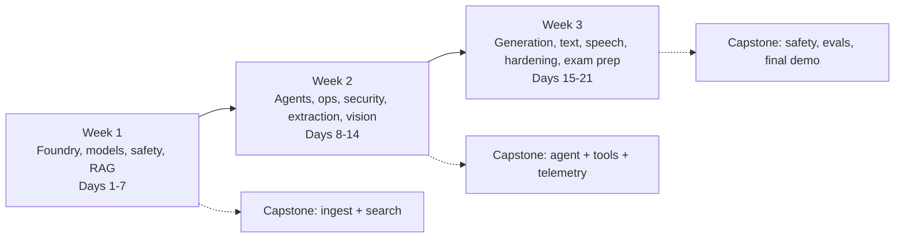

# AI-103 21-Day Preparation Plan

Exam: **AI-103 Developing AI Apps and Agents on Azure** (certification: Azure AI Apps and Agents Developer Associate).
Study guide: <https://learn.microsoft.com/en-us/credentials/certifications/resources/study-guides/ai-103> (skills measured as of April 16, 2026). Re-check it before you book; Microsoft can change it.

This repository is a Markdown-only plan plus small helper files. You build the code yourself in `src/` while following it.

## Your profile and constraints

| Item | Plan assumption |
|---|---|
| Background | Experienced .NET developer, Python beginner (no async yet), Azure beginner |
| Time | Weekdays 60-90 min (planned 75), weekends 4-5 h (planned 270 min) |
| Budget | EUR 10-25 total. Free tiers first. Target spend is about EUR 8-15, hard stop EUR 25 ([COST_TRACKER.md](COST_TRACKER.md)) |
| Labs | Python CLI only. No web front ends |
| Python | 3.14 by default; documented fallbacks for packages without a 3.14 classifier |
| Start day | Day 1 = **Monday**. Weekend deep days are 6, 7, 13, 14, 20, 21. If you start on another weekday, keep the day order and move the long days to your weekends; swap Day 1 with the first weekend only if needed |

## How each day works

Learn -> Visualize -> Build -> Break/Fix -> Verify -> Review. Target mix: 20-30% theory, 60-70% hands-on, 10-20% review.
Every `week-XX/day-XX.md` has the same 18 sections (day at a glance ... time budget), so you always know where to look.

Labels used everywhere:

| Label | Meaning |
|---|---|
| **Exam Essential** | Maps to a bullet in the AI-103 skills measured |
| **Supporting Knowledge** | Not a named bullet but needed to build or reason about the exam topics (for example Microsoft Agent Framework, MCP) |
| **Optional / Stretch** | Skip when behind schedule; do it when ahead |
| **AI-500 Foundation** | Prepares for the AI-500 multi-agent certification ([ai-500-bridge](ai-500-bridge/README.md)) |

## Roadmap

## 21-day schedule

Domain weights from the study guide: Plan/manage 25-30%, Generative AI and agents 30-35%, Vision 10-15%, Text analysis 10-15%, Information extraction 10-15%. About 60% of days therefore go to the first two domains.

| Day | Weekday | Planned | Theme | Primary domains | Lab |
|---|---|---|---|---|---|
| [1](week-01/day-01.md) | Mon | 75 min | Tooling, Azure account, cost guardrails, Python 3.14 compatibility gate | D1 | [00](labs/lab-00-setup-and-compat-gate.md) |
| [2](week-01/day-02.md) | Tue | 75 min | Foundry resource and project, keyless auth, first model call | D1, D2 | [01](labs/lab-01-foundry-first-call.md) |
| [3](week-01/day-03.md) | Wed | 75 min | Model selection, deployment types, quotas, cost | D1, D2 | [02](labs/lab-02-model-comparison-and-cost.md) |
| [4](week-01/day-04.md) | Thu | 75 min | Prompting, parameters, structured output, self-critique, async primer | D2, D4 | [03](labs/lab-03-prompting-and-structured-output.md) |
| [5](week-01/day-05.md) | Fri | 75 min | Content safety, guardrails, evaluation basics | D1, D2 | [04](labs/lab-04-safety-and-guardrails.md) |
| [6](week-01/day-06.md) | Sat | 270 min | RAG build on Azure AI Search (index, embeddings, hybrid, semantic) | D5, D2, D1 | [05](labs/lab-05-rag-ai-search.md) |
| [7](week-01/day-07.md) | Sun | 270 min | RAG quality, index health, grounding evaluation, **Week 1 checkpoint** | D2, D1, D5 | [05](labs/lab-05-rag-ai-search.md) |
| [8](week-02/day-08.md) | Mon | 75 min | Foundry agents and function tools | D2, D1 | [06](labs/lab-06-foundry-agent-function-tools.md) |
| [9](week-02/day-09.md) | Tue | 75 min | Agent knowledge, MCP, toolbox, tool-access controls | D2, D1, D5 | [07](labs/lab-07-agent-knowledge-and-mcp.md) |
| [10](week-02/day-10.md) | Wed | 75 min | Microsoft Agent Framework, multi-agent, approvals | D2, D1 | [08](labs/lab-08-agent-framework-multi-agent.md) |
| [11](week-02/day-11.md) | Thu | 75 min | Observability, tracing, agent evaluation, error analysis | D2, D1 | [09](labs/lab-09-tracing-and-evaluation.md) |
| [12](week-02/day-12.md) | Fri | 75 min | Security, networking, CI/CD, quotas, governance | D1 | [10](labs/lab-10-security-and-cicd.md) |
| [13](week-02/day-13.md) | Sat | 270 min | Document extraction: Document Intelligence, Content Understanding, OCR skills | D5, D2 | [11](labs/lab-11-document-extraction.md) |
| [14](week-02/day-14.md) | Sun | 270 min | Vision understanding, Content Understanding for images/video, visual safety, **Week 2 checkpoint** | D3 | [12](labs/lab-12-vision-understanding.md) |
| [15](week-03/day-15.md) | Mon | 75 min | Image and video generation and editing | D3 | [13](labs/lab-13-image-generation-and-editing.md) |
| [16](week-03/day-16.md) | Tue | 75 min | Text analysis, PII, sentiment, translation | D4 | [14](labs/lab-14-text-analysis-and-translation.md) |
| [17](week-03/day-17.md) | Wed | 75 min | Speech and audio | D4 | [15](labs/lab-15-speech-and-audio.md) |
| [18](week-03/day-18.md) | Thu | 75 min | Capstone hardening and red-team tests | D1, D2, D3 | [16](labs/lab-16-capstone-hardening.md) |
| [19](week-03/day-19.md) | Fri | 75 min | Practice assessment, exam-style review, **Week 3 checkpoint** | All | - |
| [20](week-03/day-20.md) | Sat | 270 min | Remediation and final practical assessment | All | - |
| [21](week-03/day-21.md) | Sun | 270 min | Final review, readiness decision, AI-500 bridge, cleanup | All | - |

Planned total: 15 weekdays x 75 min + 6 weekend days x 270 min = 2,745 min (about 45.8 h).

## Repository map

| Path | Purpose |
|---|---|
| [TRACKER.md](TRACKER.md) | Progress table, status values, objective-to-day map |
| [EXAM_OBJECTIVES.md](EXAM_OBJECTIVES.md) | All 64 skills-measured bullets with local IDs mapped to days and labs |
| [COST_TRACKER.md](COST_TRACKER.md) | Per-resource budget, alerts, deletion checklist |
| [RESOURCES.md](RESOURCES.md) | Official links, with verification status |
| [GLOSSARY.md](GLOSSARY.md) | Terms, with .NET analogies |
| [CATCH_UP_PLAN.md](CATCH_UP_PLAN.md) | What to do after missing 1, 2 or 3 days |
| `week-01/`, `week-02/`, `week-03/` | Weekly dashboards and daily files |
| `labs/` | Structured 17-field lab briefs; the day file holds the full steps |
| `capstone/` | KnowledgeDesk CLI: README, ARCHITECTURE, REQUIREMENTS, TASKS, TESTING, SECURITY, COSTS |
| `exam-prep/` | Checklist, domain review, practical assessment, weak areas |
| [ai-500-bridge](ai-500-bridge/README.md) | AI-103 to AI-500 next steps |
| `scripts/compat_check.py` | Day 1 package compatibility gate |
| `requirements-core.txt`, `requirements-extras.txt`, `.env.example` | Dependencies and configuration template |

Your own code goes in `src/labs/` (one script per lab) and `src/knowledgedesk/` (capstone). Both are created on Day 1.

## Python 3.14 policy

- Default interpreter is Python 3.14. The Azure SDK for Python version policy lists 3.14 as supported (<https://github.com/Azure/azure-sdk-for-python/blob/main/doc/python_version_support_policy.md>, checked 2026-10-04).
- **Tier A** packages declare 3.14 on PyPI: `azure-ai-projects`, `openai`, `azure-identity`, `agent-framework`, `azure-monitor-opentelemetry`, `pydantic`.
- **Tier B** packages do not declare 3.14 on PyPI (Search, Content Safety, Evaluation, Content Understanding, Document Intelligence, Text Analytics, Translation, Vision, Speech). They installed and imported on 3.14 during planning, but only [Day 1](week-01/day-01.md) on your machine decides.
- Fallbacks (separate venvs, created only if the gate fails): `.venv313` for Search, Content Understanding, Translation, Speech; `.venv311` for Content Safety and Evaluation. Documented in [Day 1](week-01/day-01.md).
- `azure-ai-contentunderstanding` is pinned to 1.1.0 because an unpinned install can resolve to a pre-release.
- The exam does not test your Python version. The fallback never costs exam marks.

## Things this plan deliberately flags as unverified

Prices (always confirm in the portal and Cost Management), model availability per region, quotas in your subscription, access approval for image and video models, Prompt Shields client method names, and any code line marked **verify**. Where a day says "verify", read the linked quickstart before trusting the snippet.

## Start here

1. Read [CATCH_UP_PLAN.md](CATCH_UP_PLAN.md) once, so a missed day does not become a crisis.
2. Open [week-01/README.md](week-01/README.md), then [Day 1](week-01/day-01.md).
3. After every day, fill the progress entry at the bottom of the day file and update [TRACKER.md](TRACKER.md).
