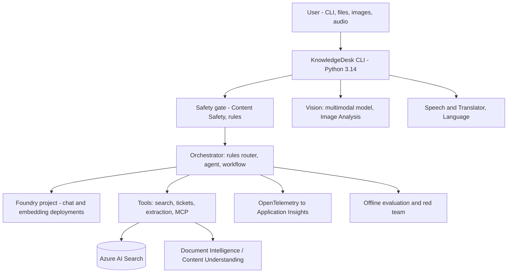
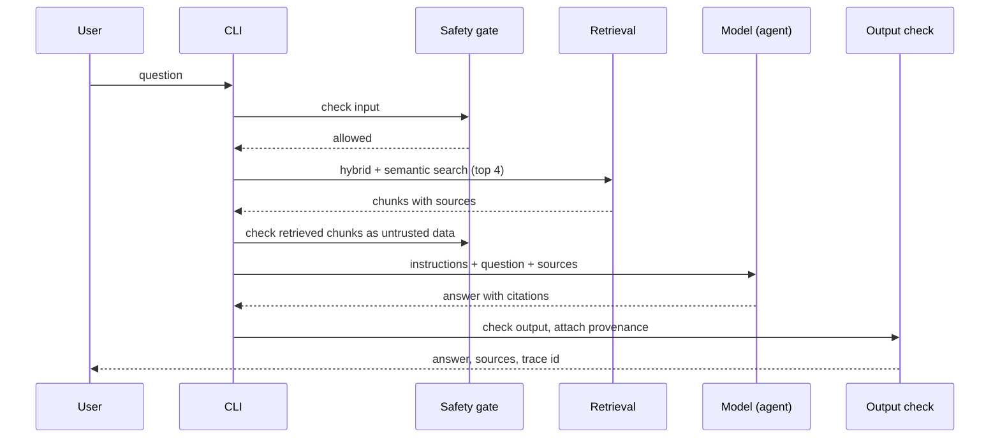
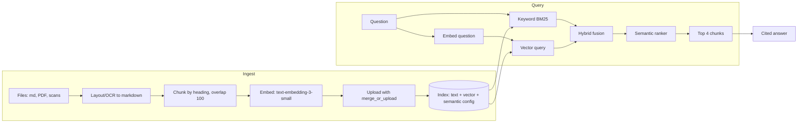
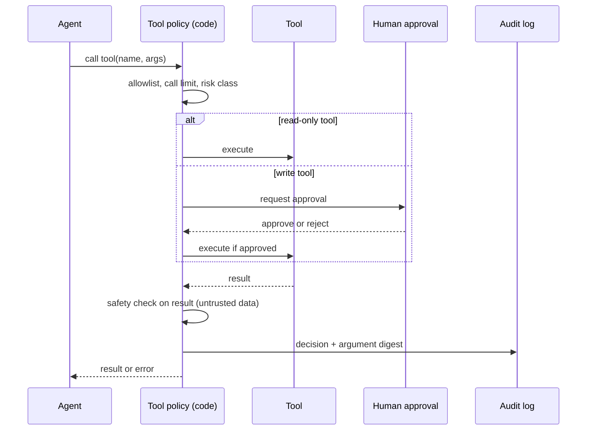
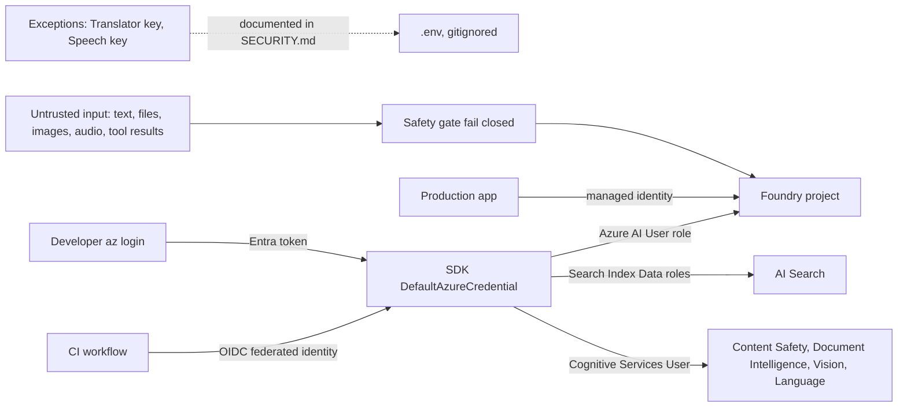
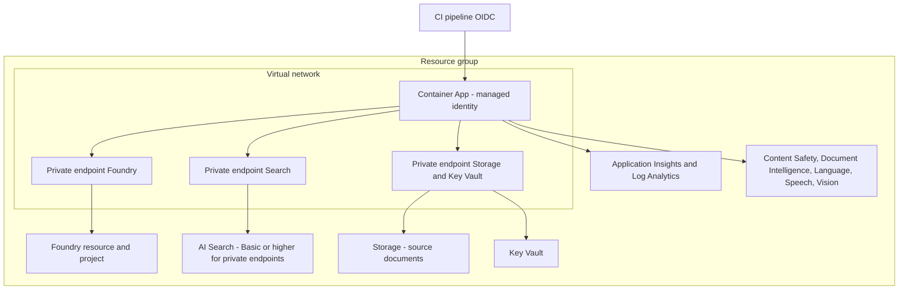

# KnowledgeDesk CLI: Architecture

Six diagrams that evolve over the three weeks. Update the "Status" column as you build; the diagrams show the **target** end state, with labels telling you when each part arrives.

| Diagram | Week 1 | Week 2 | Week 3 |
|---|---|---|---|
| 1 High-level architecture | Foundry client, safety, search | Agent, tools, telemetry, extraction, vision | Text, speech, generation, red team |
| 2 Request/data flow | Question -> grounded answer | Tools, approval, traces | Voice, image intake, gates |
| 3 RAG pipeline | Push ingestion, hybrid, citations | Layout-aware ingestion, extraction | Final tuned settings |
| 4 Agent/tool interaction | - | Function, search, MCP, approval | Hardened policy, rules router |
| 5 Auth and security | Keyless local | Tool policy, identity matrix, network design | Red-team controls |
| 6 Azure deployment | Local only + resources | Target production design | Cost-checked final design |

## 1. High-level architecture

## 2. Request and data flow (grounded question)

## 3. RAG pipeline

Record your final values here: chunk size ___, overlap ___, top k ___, search mode ___, index name ___.

## 4. Agent and tool interaction

Tools: `search_knowledge` (read), `get_ticket_status` (read), `create_ticket` (write, approval), `extract_invoice` (read, restricted folder), optional MCP documentation tool (approval).

## 5. Authentication and security flow

## 6. Azure deployment (target design)

Prep reality: the course uses a local CLI and Free/F0 tiers; this diagram is the design target you can explain on the exam, not something you deploy on a EUR 25 budget (Free Search does not support private endpoints).

## Design records (fill during the course)

### Model decision matrix (Day 3)

| Task | Model | Reason | Estimated cost per 1,000 requests |
|---|---|---|---|
| Grounded answer | | | |
| Classification | | | |
| Embeddings | | | |
| Image understanding | | | |

### Service decision table (Day 16)

| Need | Language service | LLM | Translator |
|---|---|---|---|
| Sentiment at scale | | | |
| Custom schema extraction | | | |
| Translation with tone | | | |

### Network design notes (Day 12)

Private endpoints needed: ___. Private DNS zones: ___. Developer access path: ___. Free Search consequences: ___.

### Pull pipeline design (Day 13)

Data source ___, indexer ___, skillset (layout, split, embed) ___, projections ___, schedule ___.
