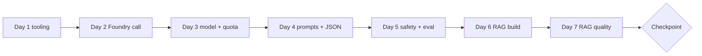

# Week 1 Dashboard: Foundry, Models, Safety and RAG (Days 1-7)

Goal: a keyless Foundry connection, a justified model choice, a safety gate, and a measured RAG pipeline on Azure AI Search Free.

## Days

| Day | Weekday | Planned | Topic | Objectives | Lab | Status |
|---|---|---|---|---|---|---|
| [1](day-01.md) | Mon | 75 | Tooling, cost guardrails, compatibility gate | D1-09 | [00](../labs/lab-00-setup-and-compat-gate.md) | Not Started |
| [2](day-02.md) | Tue | 75 | Foundry project, keyless auth, first call | D1-05/07/12, D2-01/05/06 | [01](../labs/lab-01-foundry-first-call.md) | Not Started |
| [3](day-03.md) | Wed | 75 | Model selection, deployments, quotas | D1-01/02/06/09 | [02](../labs/lab-02-model-comparison-and-cost.md) | Not Started |
| [4](day-04.md) | Thu | 75 | Prompting, structured output, async | D2-13/14/03, D4-01 | [03](../labs/lab-03-prompting-and-structured-output.md) | Not Started |
| [5](day-05.md) | Fri | 75 | Safety, guardrails, evaluation basics | D1-13/14, D2-04 | [04](../labs/lab-04-safety-and-guardrails.md) | Not Started |
| [6](day-06.md) | Sat | 270 | RAG build | D1-03, D2-02, D5-01/02 | [05](../labs/lab-05-rag-ai-search.md) | Not Started |
| [7](day-07.md) | Sun | 270 | RAG quality and checkpoint | D2-04, D1-10/11 | [05](../labs/lab-05-rag-ai-search.md) | Not Started |

Planned total: 5 x 75 + 2 x 270 = 915 min. Domain mix: roughly 45% plan/manage, 40% generative AI, 15% extraction.

## Weekly diagram

## Checkpoint (Day 7)

### Readiness checklist (pass = all ticked)

- [ ] `compat_check.py` result recorded; any fallback venv created and documented.
- [ ] Keyless call works; no API keys in `.env` except a documented exception.
- [ ] Decision matrix for chat and embedding models written.
- [ ] Safety gate blocks a prompt-attack document before the model sees it.
- [ ] RAG answers cite sources and refuse unknown questions.
- [ ] Metrics table (hit@1, hit@4, MRR) and evaluator output exist.
- [ ] Spend so far is under EUR 6 ([COST_TRACKER.md](../COST_TRACKER.md)).
- [ ] You can explain the Day 7 failure taxonomy without notes.

### Self-quiz (10 questions, 20 minutes, no notes)

1. Name the two parts of a Foundry connection string you need for the SDK and where to find them.
2. Which role type allows you to call a model: control-plane or data-plane?
3. State two ways to reduce cost per request without changing the task.
4. What HTTP status signals throttling and what is the first fix?
5. Give one example each of a direct and indirect prompt attack.
6. When does hybrid beat vector-only?
7. What happens to retrieval if you change the embedding model without re-indexing?
8. Which evaluator checks that an answer stays within the retrieved text?
9. List three index-health signals.
10. Name two Azure AI Search Free tier limits.

Answers

1. Project endpoint (portal project overview) and deployment name (Models + endpoints). 2. Data-plane role. 3. Smaller model, shorter prompts, caching, limiting output tokens, batch. 4. 429; retry with backoff. 5. Direct: "ignore all instructions" typed by the user. Indirect: hidden instructions in a retrieved document. 6. When exact terms/codes matter alongside meaning. 7. Vectors are incompatible, results are wrong; re-embed and re-index. 8. Groundedness. 9. Count mismatch, failed uploads, storage %, missing vectors, zero-result rate. 10. 50 MB storage, 3 indexes, no private endpoints.

Scoring: 9-10 strong; 7-8 acceptable, note weak items; under 7 means spend 45 minutes next weekend on the weak topics before Day 13.

## Weak-area log

| Topic | Days to revisit | Fixed? |
|---|---|---|
| | | |

## Links

[Main README](../README.md) | [Tracker](../TRACKER.md) | [Week 2](../week-02/README.md) | [Catch-up plan](../CATCH_UP_PLAN.md)
