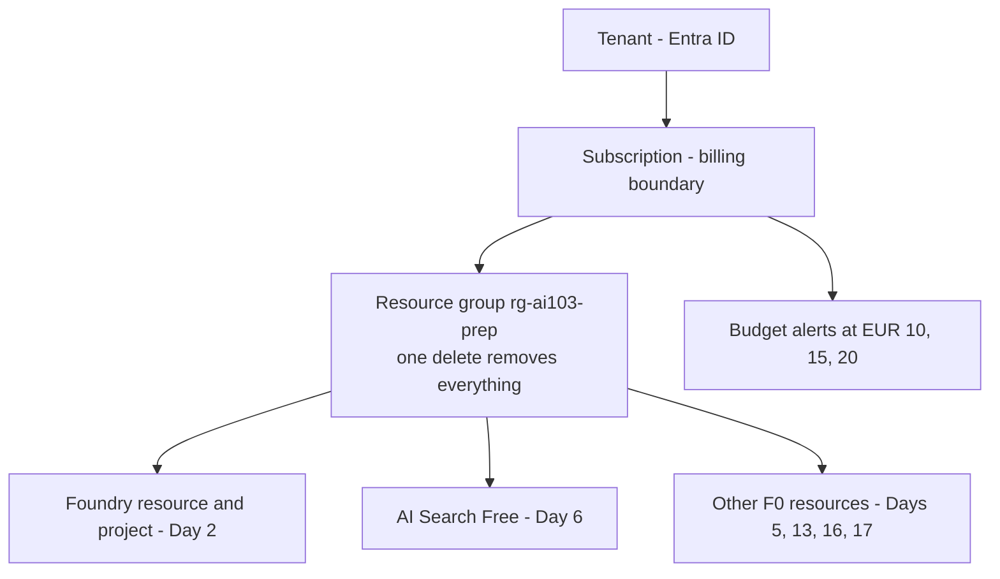

## Day 1: Tooling, Cost Guardrails and the Python 3.14 Compatibility Gate

### 1. Day at a Glance

| Item | Value |
|---|---|
| Weekday / time | Monday, 75 min planned |
| Status | Not Started (track in [TRACKER.md](../TRACKER.md)) |
| Difficulty | 2/5 |
| Objectives | D1-09 (cost footprint, partial), D1-05 (infrastructure, preparation) |
| Label | Exam Essential (cost), Supporting Knowledge (Python tooling) |
| Resources created | Resource group `rg-ai103-prep`, Azure budget alerts. Nothing billable |
| Estimated cost | EUR 0 |
| Lab | [Lab 00](../labs/lab-00-setup-and-compat-gate.md) |
| Capstone milestone | M0 repo and config skeleton, cost guard |

### 2. Why This Matters

Cost surprises and broken Python environments are the two most common reasons learners stall. Setting alerts first and proving your SDK set imports on Python 3.14 now saves hours later. The cost-management part also supports the exam topic "manage quotas, scaling, rate limits, and cost footprints".

### 3. Prerequisites

- A Microsoft account that can create an Azure subscription (or an existing subscription where you can create resources and budgets).
- Windows terminal (PowerShell), Python 3.14 installed, git, VS Code.
- A payment method may be required to sign up; the plan uses free tiers and small pay-per-use calls.

### 4. Learning Outcomes

- Explain the Azure hierarchy: tenant, subscription, resource group, resource.
- Create a resource group and cost budget with alerts.
- Create a Python 3.14 virtual environment and run the compatibility gate.
- Know which fallback venv to use when a package fails to import.
- Add a local token budget guard that every later script reuses.

### 5. Visual Explanation



### 6. Learn

Theory (15 min):

1. **Azure hierarchy** (7 min). .NET analogy: subscription is the billing account, resource group is a solution folder, a resource is a deployed service. Roles (RBAC) are assigned at any level and are inherited downward.
2. **Cost control** (4 min). Azure budgets alert; they do not stop spending. Only deleting or not creating resources prevents cost. Free tiers have fixed quotas, but pay-per-token model calls have no cap unless you add your own.
3. **Python environment hygiene** (4 min). A virtual environment is a per-project folder with its own packages (like a local `packages` folder). Always activate it. Packages without a declared 3.14 classifier may still work; you test that, you do not guess.

### 7. Resources

| Study | Link |
|---|---|
| Install Azure CLI on Windows | <https://learn.microsoft.com/en-us/cli/azure/install-azure-cli-windows> |
| Create budgets | <https://learn.microsoft.com/en-us/azure/cost-management-billing/costs/tutorial-acm-create-budgets> |
| Azure SDK for Python version policy | <https://github.com/Azure/azure-sdk-for-python/blob/main/doc/python_version_support_policy.md> |
| Learn module (skim unit 1-2 only) | `prepare-azure-ai-development` under [RESOURCES.md](../RESOURCES.md) |

### 8. Hands-On Lab

Open PowerShell in `c:\Learn\ai-103-prep`.

**Step 1: Azure CLI (8 min).**

```powershell
winget install -e --id Microsoft.AzureCLI
# Close and reopen PowerShell, then:
az --version
az login
az account show --query "{name:name, id:id}" -o table
```

If the subscription shown is not the one you want, run `az account set --subscription "<name or id>"`.

**Step 2: Resource group (2 min).** A resource group's location is only metadata; resources inside can use other regions.

```powershell
az group create --name rg-ai103-prep --location swedencentral
```

Replace the location with any EU region you prefer. You choose the model region on Day 2 after seeing where `gpt-5-mini` is available.

**Step 3: Budget (6 min, portal).** Azure Portal -> Cost Management + Billing -> Cost Management -> Budgets -> Add. Scope: your subscription. Amount: your cap in your billing currency (about EUR 25). Alert conditions: actual cost at 40%, 60%, 80% (about EUR 10, 15, 20). Add your email. Record the amounts in [COST_TRACKER.md](../COST_TRACKER.md).

**Step 4: Python environment (6 min).**

```powershell
py -3.14 -m venv .venv
.\.venv\Scripts\Activate.ps1
python --version
python -m pip install -U pip
pip install -r requirements-core.txt
pip install -r requirements-extras.txt
```

If `Activate.ps1` is blocked, run `Set-ExecutionPolicy -Scope CurrentUser RemoteSigned` once (this changes a local policy; confirm you accept that).

**Step 5: Compatibility gate (3 min).**

```powershell
python scripts\compat_check.py
```

Record the table in the progress entry. Decision rule:

| Result | Action |
|---|---|
| All `OK` | Stay on 3.14 for everything |
| Tier A failure | Stop; fix before continuing (upgrade pip, check Python version). The plan needs Tier A |
| A Tier B package fails | Create the fallback venv below and use it **only** for that day's script |

Fallback environments (create only when needed):

```powershell
# Search / Content Understanding / Translation / Speech candidates
uv venv .venv313 --python 3.13
uv pip install --python .venv313\Scripts\python.exe -r requirements-core.txt
# Content Safety / Evaluation candidates (uv has 3.11 locally)
uv venv .venv311 --python 3.11
uv pip install --python .venv311\Scripts\python.exe azure-ai-contentsafety azure-ai-evaluation azure-identity openai python-dotenv
```

If `uv` is not installed, use `py -3.13 -m venv .venv313` when that interpreter exists.

**Step 6: Skeleton and cost guard (15 min).**

```powershell
git init   # skip if this folder is already a repository
mkdir src\common, src\labs, src\knowledgedesk, out | Out-Null
New-Item src\common\__init__.py, src\knowledgedesk\__init__.py -ItemType File | Out-Null
```

`src\common\config.py`:

```python
import os

from dotenv import load_dotenv

load_dotenv()


def require(name: str) -> str:
    value = os.getenv(name)
    if not value:
        raise RuntimeError(f"Missing {name}. Copy .env.example to .env and fill it in.")
    return value
```

`src\common\cost_guard.py`:

```python
import json
import os
from datetime import date
from pathlib import Path

_STATE = Path("out") / "token_usage.json"


def _load() -> dict:
    if _STATE.exists():
        data = json.loads(_STATE.read_text())
        if data.get("day") == date.today().isoformat():
            return data
    return {"day": date.today().isoformat(), "tokens": 0}


def record_tokens(count: int) -> int:
    """Add tokens to today's total and stop the script when over budget."""
    budget = int(os.getenv("DAILY_TOKEN_BUDGET", "200000"))
    state = _load()
    state["tokens"] += count
    _STATE.parent.mkdir(exist_ok=True)
    _STATE.write_text(json.dumps(state))
    if state["tokens"] > budget:
        raise RuntimeError(f"Daily token budget exceeded: {state['tokens']} > {budget}")
    return state["tokens"]
```

Copy the environment template: `Copy-Item .env.example .env`.

Run from the repo root with `$env:PYTHONPATH="src"` (or `python -m` style imports). Test:

```powershell
$env:PYTHONPATH="src"
python -c "from common.cost_guard import record_tokens; print(record_tokens(100))"
```

### 9. Break/Fix Challenge

**Break 1: wrong interpreter.** Open a new PowerShell without activating `.venv` and run `python scripts\compat_check.py`. Expected: most packages show `NOT INSTALLED`. Diagnose with `Get-Command python` and `python -c "import sys; print(sys.prefix)"`; fix by activating `.venv`.

**Break 2: guard trips.** Set `$env:DAILY_TOKEN_BUDGET="50"` and call `record_tokens(100)`. Expected: `RuntimeError`. Reset it to 200000 and delete `out\token_usage.json`.

### 10. Capstone Progress

M0 done: `src/common/config.py`, `src/common/cost_guard.py`, `.env`, virtual environment. See [capstone/TASKS.md](../capstone/TASKS.md).

### 11. Validation

- [ ] `az account show` returns your subscription.
- [ ] `az group show --name rg-ai103-prep --query name -o tsv` prints the group name.
- [ ] Portal shows a budget with 3 alerts.
- [ ] `python scripts\compat_check.py` shows Tier A all `OK`; Tier B statuses recorded.
- [ ] `record_tokens(100)` prints a number, and fails when the budget is tiny.

### 12. Exam Focus

- **D1-09:** know the levers for cost: model choice, deployment type, capacity (TPM), token limits, caching, batch, budgets and alerts.
- Know that budgets alert only, and that quotas are per subscription, region and model.
- Do not memorize Python version trivia; the exam does not test it.

### 13. Review Questions

1. A budget alert fired at 80%. What stops further spend? 2. Where do you check which package versions your script is really using? 3. What is the benefit of one resource group for a whole prep? 4. Why is Tier B not automatically unsafe on Python 3.14? 5. Which later days need the fallback venvs if the gate fails?

<details><summary>Answers</summary>

1. Nothing automatic; you must delete/stop resources (or remove keys/permissions). 2. `pip list` / `compat_check.py` inside the activated venv. 3. One delete removes all resources and billing sources. 4. It is tested by import/install on your machine, and the SDK policy lists 3.14 as supported; absent classifier is not a failure. 5. Days 5 and 11 (Content Safety, Evaluation) for `.venv311`; Days 6, 13, 16, 17 for `.venv313`.

</details>

### 14. Definition of Done

- [ ] Lab validation checks all pass.
- [ ] Break/fix 1 and 2 reproduced and fixed.
- [ ] [COST_TRACKER.md](../COST_TRACKER.md) budget amounts recorded.
- [ ] Compatibility results recorded below.
- [ ] Progress entry filled and [TRACKER.md](../TRACKER.md) updated.

### 15. Cleanup

Nothing billable exists. Keep the resource group. Do not commit `.env`.

### 16. Progress Entry

| Field | Value |
|---|---|
| Status | Not Started |
| Theory done | |
| Lab done | |
| Break/fix done | |
| Capstone done | |
| Review done | |
| Planned time | 75 min |
| Actual time | |
| Confidence (1-5) | |
| Weak areas | |
| Compat gate result (Tier B failures) | |

### 17. Navigation

Previous: none | Next: [Day 2](day-02.md) | [Week 1 dashboard](README.md) | [Main README](../README.md) | [Tracker](../TRACKER.md)

### 18. Time Budget

| Block | Minutes |
|---|---|
| Learn | 15 |
| Build (lab steps 1-6) | 40 |
| Break/Fix | 8 |
| Verify | 5 |
| Review and progress entry | 7 |
| **Total** | **75** |
