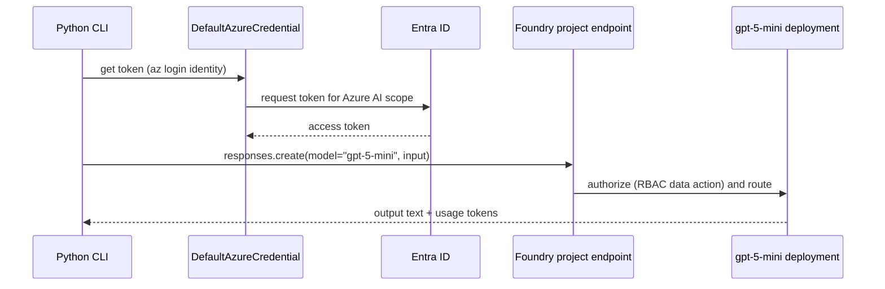

## Day 2: Foundry Project, Keyless Authentication and Your First Model Call

### 1. Day at a Glance

| Item | Value |
|---|---|
| Weekday / time | Tuesday, 75 min planned |
| Status | Not Started |
| Difficulty | 2/5 |
| Objectives | D1-05, D1-07, D1-12 (keyless), D2-01, D2-05, D2-06 |
| Label | Exam Essential |
| Resources created | Foundry resource and project, `gpt-5-mini` deployment, one role assignment |
| Estimated cost | about EUR 0.10 |
| Lab | [Lab 01](../labs/lab-01-foundry-first-call.md) |
| Capstone milestone | M1 keyless Foundry client wrapper |

### 2. Why This Matters

Everything else in the exam sits on one connection: an application authenticates to a Foundry project and calls a deployment. Keyless Entra authentication is the default expectation in the study guide ("keyless credentials, managed identity, role policies").

### 3. Prerequisites

[Day 1](day-01.md) complete: CLI logged in, `.venv` active, `.env` exists, cost guard works.

### 4. Learning Outcomes

- Describe resource, project, deployment, endpoint and how they relate.
- Create a project and deploy a model with a small capacity.
- Assign a data-plane role and authenticate with `DefaultAzureCredential`.
- Make a Responses API call with the Foundry SDK and read token usage.
- Explain why Owner alone is not enough for calling a model.

### 5. Visual Explanation



### 6. Learn

Theory (15 min):

1. **Resource, project, deployment** (5 min). The Foundry **resource** is the Azure resource; a **project** inside it holds agents and evaluations and has an endpoint of the form `https://<resource>.services.ai.azure.com/api/projects/<project>`. A **deployment** is a named model instance with a type (for example Global Standard) and a capacity.
2. **Auth** (5 min). `DefaultAzureCredential` tries several sources; locally it uses your `az login`. In production prefer a specific credential such as managed identity. A token is useless without a role: Owner/Contributor are control-plane roles; calling models needs a data-plane role from the Foundry RBAC page.
3. **Python primer for .NET developers** (5 min):

| C# | Python |
|---|---|
| `var x = 3;` | `x = 3` |
| `string.Format` / `$"{x}"` | `f"{x}"` |
| `Dictionary<string,int>` | `dict`, `{"a": 1}` |
| `using var c = ...` | `with ... as c:` |
| `Main` | `if __name__ == "__main__":` |
| `appsettings.json` | `.env` via `load_dotenv()` |

### 7. Resources

| Study | Link |
|---|---|
| Install CLI and SDK | <https://learn.microsoft.com/en-us/azure/foundry/how-to/develop/install-cli-sdk> |
| Responses API | <https://learn.microsoft.com/en-us/azure/foundry/openai/how-to/responses> |
| Foundry RBAC | <https://learn.microsoft.com/en-us/azure/foundry/concepts/rbac-foundry> |
| SDK authentication | <https://learn.microsoft.com/en-us/azure/developer/python/sdk/authentication/overview> |
| Learn module `foundry-sdk` | listed in [RESOURCES.md](../RESOURCES.md) (skim the connect-and-chat unit) |

### 8. Hands-On Lab

**Step 1: Project (10 min).** In the Foundry portal (ai.azure.com) create a new project. Choose resource group `rg-ai103-prep`, a name such as `ai103-prep`, and an EU region. Confirm the region offers `gpt-5-mini` in the deployment dialog before you commit. If the model is not available in that region, create the project elsewhere; keep all later resources in the same region when practical.

**Step 2: Deploy (7 min).** Models + endpoints -> Deploy base model -> `gpt-5-mini`. Deployment name `gpt-5-mini`, type **Global Standard**, capacity at or near the minimum. Note the deployment type and capacity in [COST_TRACKER.md](../COST_TRACKER.md).

**Step 3: Role (6 min).** Find the resource ID, then grant yourself the data-plane role. The role name below is the one expected on the RBAC page; confirm it there.

```powershell
az cognitiveservices account list -g rg-ai103-prep --query "[].{name:name,id:id}" -o table
$scope = "<resource id from above>"
az role assignment create --assignee "<your sign-in name>" --role "Azure AI User" --scope $scope
```

Role changes can take a few minutes to apply.

**Step 4: Config (3 min).** Copy the **project endpoint** from the project overview into `.env` as `AZURE_AI_PROJECT_ENDPOINT`. Keep `AZURE_AI_MODEL_DEPLOYMENT=gpt-5-mini`.

**Step 5: First call (10 min).** `src\labs\lab01_first_call.py`:

```python
from azure.ai.projects import AIProjectClient
from azure.identity import DefaultAzureCredential

from common.config import require
from common.cost_guard import record_tokens

project = AIProjectClient(
    endpoint=require("AZURE_AI_PROJECT_ENDPOINT"),
    credential=DefaultAzureCredential(),
)
openai_client = project.get_openai_client()

response = openai_client.responses.create(
    model=require("AZURE_AI_MODEL_DEPLOYMENT"),
    input="In two sentences, what is a resource group in Azure?",
)
print(response.output_text)
print("tokens:", response.usage.input_tokens, response.usage.output_tokens)
record_tokens(response.usage.total_tokens)
```

Run: `$env:PYTHONPATH="src"; python src\labs\lab01_first_call.py`.

**Step 6: Wrapper (4 min).** `src\knowledgedesk\foundry_client.py`:

```python
from azure.ai.projects import AIProjectClient
from azure.identity import DefaultAzureCredential

from common.config import require
from common.cost_guard import record_tokens


def get_clients():
    project = AIProjectClient(
        endpoint=require("AZURE_AI_PROJECT_ENDPOINT"),
        credential=DefaultAzureCredential(),
    )
    return project, project.get_openai_client()


def ask(openai_client, text: str, instructions: str | None = None) -> str:
    response = openai_client.responses.create(
        model=require("AZURE_AI_MODEL_DEPLOYMENT"),
        input=text,
        instructions=instructions,
    )
    record_tokens(response.usage.total_tokens)
    return response.output_text
```

If the SDK rejects a call shape, follow the quickstart linked in Resources; SDK 2.x differs from 1.x.

### 9. Break/Fix Challenge

1. **Remove the role** (Portal -> resource -> Access control (IAM) -> delete your assignment) and re-run. Expected: authorization error (401/403). Diagnose by reading the error and checking IAM; restore the role and retry after a few minutes.
2. **Wrong deployment name**: set `AZURE_AI_MODEL_DEPLOYMENT=gpt5mini`. Expected: not-found error for the deployment. Fix the name.
3. **Wrong tenant/account**: run `az account show` and confirm the subscription is the one that owns the resource.

### 10. Capstone Progress

M1: `get_clients()` and `ask()` created. Every later module imports them.

### 11. Validation

- [ ] The script prints an answer and token counts.
- [ ] `az role assignment list --scope $scope --assignee "<you>" -o table` shows the data-plane role.
- [ ] No API key appears in `.env` or code.
- [ ] You can state the project endpoint format and where you found it.

### 12. Exam Focus

- Keyless > keys. Know the roles needed (data-plane vs control-plane).
- Know the call path: SDK -> project endpoint -> deployment name.
- Deployment type, capacity and region are properties you configure (D1-07).
- Trap: using the **model name** when the SDK expects the **deployment name**.

### 13. Review Questions

1. What is the difference between the Foundry resource and the project? 2. Why does an Owner still get 403 when calling a model? 3. Which credential would you use for local development and which for production? 4. Where do you read how many tokens a call used? 5. What do you change to move from `DefaultAzureCredential` to a managed identity in production?

<details><summary>Answers</summary>

1. Resource = Azure resource with deployments; project = workspace with its own endpoint holding agents/evals/connections. 2. Owner is control-plane; calling models requires a data-plane role. 3. Local: `DefaultAzureCredential` (az login); production: a specific credential like `ManagedIdentityCredential`. 4. `response.usage`. 5. Give the host a managed identity, grant it the role, construct `ManagedIdentityCredential`.

</details>

### 14. Definition of Done

- [ ] Lab validation passes.
- [ ] Both break/fix cases reproduced and fixed.
- [ ] Wrapper module in place.
- [ ] Cost tracker updated (deployment type, capacity).
- [ ] Progress entry and tracker updated.

### 15. Cleanup

Keep the project and deployment (used all weeks). Check capacity is minimal. Nothing else to delete.

### 16. Progress Entry

| Field | Value |
|---|---|
| Status | Not Started |
| Theory done | |
| Lab done | |
| Break/fix done | |
| Capstone done | |
| Review done | |
| Planned time | 75 min |
| Actual time | |
| Confidence (1-5) | |
| Weak areas | |

### 17. Navigation

Previous: [Day 1](day-01.md) | Next: [Day 3](day-03.md) | [Week 1 dashboard](README.md) | [Main README](../README.md) | [Tracker](../TRACKER.md)

### 18. Time Budget

| Block | Minutes |
|---|---|
| Learn | 15 |
| Build (steps 1-6) | 40 |
| Break/Fix | 10 |
| Verify | 5 |
| Review and progress entry | 5 |
| **Total** | **75** |
