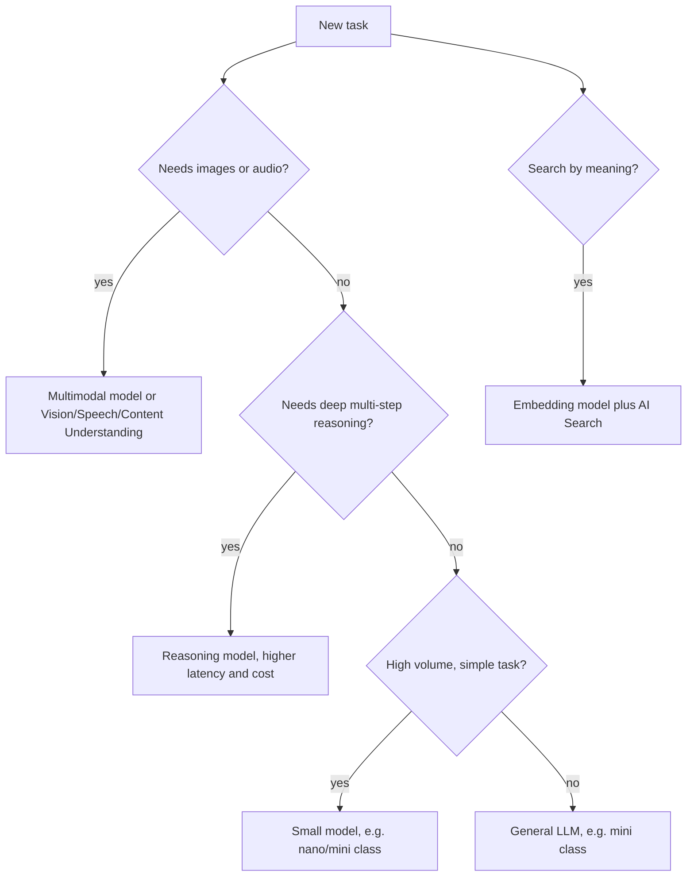

## Day 3: Model Selection, Deployment Types, Quotas and Cost

### 1. Day at a Glance

| Item | Value |
|---|---|
| Weekday / time | Wednesday, 75 min planned |
| Status | Not Started |
| Difficulty | 3/5 |
| Objectives | D1-01, D1-02, D1-06, D1-07, D1-09, D2-01 |
| Label | Exam Essential |
| Resources created | A second small model deployment (for comparison) |
| Estimated cost | about EUR 0.30 |
| Lab | [Lab 02](../labs/lab-02-model-comparison-and-cost.md) |
| Capstone milestone | M1 extended: model choice recorded in [capstone/ARCHITECTURE.md](../capstone/ARCHITECTURE.md) |

### 2. Why This Matters

"Choose an appropriate model for each task" and "manage quotas, rate limits and cost" are the first two bullets of the heaviest-adjacent domain. Exam questions give a scenario (latency, cost, modality, data residency) and ask which model, deployment type or service fits.

### 3. Prerequisites

[Day 2](day-02.md): working project, deployment, wrapper `get_clients()`.

### 4. Learning Outcomes

- Compare LLM, small model, reasoning model, multimodal and embedding models by task.
- Match deployment types to data-location, throughput and cost needs.
- Read quota and rate-limit information and handle HTTP 429 with retry and backoff.
- Estimate cost per request from token usage.
- Map a task to the right Foundry service (decision table below).

### 5. Visual Explanation



### 6. Learn

Theory (15 min):

1. **Model families** (5 min): general LLMs, small models (cheaper/faster, weaker reasoning), reasoning models (spend extra "thinking" tokens), multimodal models (accept images/audio), code models, embedding models (vectors only). Check the model catalog in the portal for what your region offers.
2. **Deployment types** (5 min). Read the deployment-types page once and build a one-row summary per type: where data may be processed, how throughput is guaranteed (pay-per-token vs provisioned), and typical use (interactive, batch). Exam angle: "predictable latency at scale" suggests provisioned throughput; "asynchronous bulk" suggests batch; "data must stay in a geography" suggests data-zone or regional types.
3. **Quotas** (5 min): quota is allocated per subscription, region, model and type; a deployment gets a share (TPM/RPM). Exceeding it returns 429. Mitigations: backoff and retry, smaller prompts, caching, spread across deployments/regions, request more quota.

Decision table (memorize the pattern, not the product list):

| Need | Choose |
|---|---|
| Chat, summarization, tool calling | LLM deployment |
| Cheap high-volume classification | Small model |
| Semantic search | Embedding deployment + Azure AI Search |
| Image or screenshot understanding | Multimodal model |
| OCR + layout + fields from files | Document Intelligence or Content Understanding |
| Speech in/out | Azure Speech |
| Fixed language translation | Translator (or an LLM when style/context matter) |
| Multi-step tool use | Agent (Foundry agent or Agent Framework) |

### 7. Resources

| Study | Link |
|---|---|
| Deployment types | <https://learn.microsoft.com/en-us/azure/foundry/foundry-models/concepts/deployment-types> |
| Quotas and limits | <https://learn.microsoft.com/en-us/azure/foundry/openai/quotas-limits> |
| Pricing (read, estimate only) | <https://azure.microsoft.com/en-us/pricing/details/azure-openai/> |
| Learn module `model-catalog-evaluate` | [RESOURCES.md](../RESOURCES.md) (first two units) |

### 8. Hands-On Lab

**Step 1: Second deployment (6 min).** Deploy a cheaper small model (for example `gpt-5-nano` if your region lists it; otherwise another small model) with the minimum capacity. Name the deployment after the model; the script below uses these names as constants.

**Step 2: Price table (4 min).** Open the pricing page, copy input/output price per 1M tokens for both models into the script constants. The values below were seen on 2026-10-04 and are estimates; overwrite them with what you see.

**Step 3: Comparison script (20 min).** `src\labs\lab02_compare.py`:

```python
import csv
import time

from common.cost_guard import record_tokens
from knowledgedesk.foundry_client import get_clients

# USD per 1M tokens (input, output). Copy from the pricing page; these are example values.
MODELS = {"gpt-5-mini": (0.25, 2.00), "gpt-5-nano": (0.05, 0.40)}
PROMPTS = [
    "Classify the sentiment (positive/neutral/negative): 'The invoice was late again.'",
    "Summarize in one sentence: Azure AI Search supports keyword, vector and hybrid queries.",
    "Extract the date and amount as JSON: 'Paid 120 EUR on 2026-03-14.'",
    "Explain the difference between a resource and a project in two bullets.",
    "Write a polite two-sentence reply to a customer asking for a refund.",
]

_, client = get_clients()
rows = []
for model, (price_in, price_out) in MODELS.items():
    for prompt in PROMPTS:
        start = time.perf_counter()
        r = client.responses.create(model=model, input=prompt)
        seconds = time.perf_counter() - start
        record_tokens(r.usage.total_tokens)
        cost = (r.usage.input_tokens * price_in + r.usage.output_tokens * price_out) / 1_000_000
        rows.append([model, prompt[:30], r.usage.input_tokens, r.usage.output_tokens, round(seconds, 2), round(cost, 6)])

with open("out/model_comparison.csv", "w", newline="") as f:
    csv.writer(f).writerows([["model", "prompt", "in_tok", "out_tok", "seconds", "usd"], *rows])
for row in rows:
    print(row)
```

**Step 4: Read the results (8 min).** Open the CSV. For each prompt decide which model you would ship and why (quality, latency, cost). Write the decision matrix in [capstone/ARCHITECTURE.md](../capstone/ARCHITECTURE.md).

**Step 5: Quota view (2 min).** Portal -> Foundry resource -> quotas/usage for your region. Record the TPM allocated to each deployment.

### 9. Break/Fix Challenge

Trigger and handle throttling.

1. Set the `gpt-5-nano` deployment capacity to its minimum.
2. Run 20 calls in a tight loop (`for _ in range(20)`). Expected: some `openai.RateLimitError` (429) when the minimum is small enough. If none occurs, lower capacity further or shorten the loop delay; do not raise the call count above 40.
3. Fix: add retry with backoff.

```python
import time

import openai


def call_with_retry(fn, attempts=5):
    for i in range(attempts):
        try:
            return fn()
        except openai.RateLimitError:
            time.sleep(2 ** i)
    raise RuntimeError("Still throttled after retries")
```

Optional: respect a `Retry-After` header if present.

### 10. Capstone Progress

Record the chosen **chat model**, **embedding model** and rationale in ARCHITECTURE.md (decision table). Add `call_with_retry` to `src/common/retry.py` and use it in `ask()`.

### 11. Validation

- [ ] CSV has 10 rows with token counts and a cost column.
- [ ] You can explain which deployment type you used and why it fits the lab.
- [ ] `call_with_retry` handles a forced 429 without crashing.
- [ ] Cost tracker updated with the second deployment.

### 12. Exam Focus

- Scenario mapping: modality, latency, cost, residency -> model + deployment type.
- 429 means throttling: retry with backoff; sustained load means more capacity, provisioned throughput, or another deployment.
- Embedding models are not chat models; do not confuse their deployments.
- Trap: assuming a bigger model is always the right answer.

### 13. Review Questions

1. Which deployment type family fits predictable high-volume latency? 2. A batch job must classify 2 million short texts cheaply overnight; which levers? 3. What returns HTTP 429 and what is the first mitigation? 4. When is a reasoning model a poor choice? 5. Why record token usage per call?

<details><summary>Answers</summary>

1. Provisioned throughput. 2. Small model, batch deployment type, short prompts, structured output. 3. Exceeding TPM/RPM; retry with exponential backoff. 4. Simple, latency-sensitive tasks (extra thinking tokens add cost and time). 5. Cost estimation, budget guards, and regression detection.

</details>

### 14. Definition of Done

- [ ] Lab validation passes.
- [ ] Break/fix: 429 reproduced (or documented as not reproducible) and retry added.
- [ ] Decision matrix written in ARCHITECTURE.md.
- [ ] Cost tracker updated.
- [ ] Progress entry and tracker updated.

### 15. Cleanup

Keep the second deployment only if you will use it; otherwise delete it now (it costs nothing idle but tidy resources help). Reset capacities to the minimum.

### 16. Progress Entry

| Field | Value |
|---|---|
| Status | Not Started |
| Theory done | |
| Lab done | |
| Break/fix done | |
| Capstone done | |
| Review done | |
| Planned time | 75 min |
| Actual time | |
| Confidence (1-5) | |
| Weak areas | |

### 17. Navigation

Previous: [Day 2](day-02.md) | Next: [Day 4](day-04.md) | [Week 1 dashboard](README.md) | [Main README](../README.md) | [Tracker](../TRACKER.md)

### 18. Time Budget

| Block | Minutes |
|---|---|
| Learn | 15 |
| Build (steps 1-5) | 40 |
| Break/Fix | 10 |
| Verify | 5 |
| Review and progress entry | 5 |
| **Total** | **75** |
