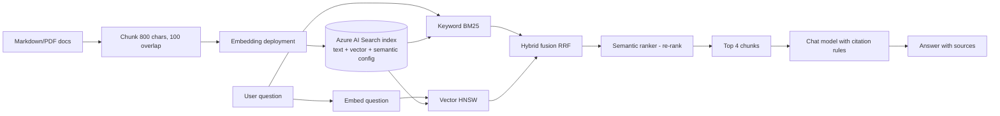

## Day 6: RAG Build on Azure AI Search

### 1. Day at a Glance

| Item | Value |
|---|---|
| Weekday / time | Saturday, 270 min planned |
| Status | Not Started |
| Difficulty | 4/5 |
| Objectives | D1-03, D2-02, D5-01, D5-02, D5-03 (concept), D1-11 (first look) |
| Label | Exam Essential |
| Resources created | Azure AI Search **Free**, embedding deployment |
| Estimated cost | about EUR 0.30 (embeddings and a few chat calls) |
| Lab | [Lab 05](../labs/lab-05-rag-ai-search.md) (part 1) |
| Capstone milestone | M4 index and hybrid search |

### 2. Why This Matters

RAG is the backbone of most Foundry apps and appears in three domains: choosing a retrieval method (D1), implementing RAG (D2), and configuring semantic/hybrid/vector search (D5). Today you build the retrieval half; Day 7 measures it.

### 3. Prerequisites

[Day 5](day-05.md). Python venv active (use `.venv313` for the Search SDK only if the Day 1 gate failed).

### 4. Learning Outcomes

- Explain keyword, vector, hybrid and semantic retrieval and when each wins.
- Design an index with a vector field, a vector profile and a semantic configuration.
- Chunk documents with overlap and justify the sizes.
- Embed chunks and upload them in batches.
- Run four query modes and compare results.
- Produce a grounded answer with numbered citations.

### 5. Visual Explanation



### 6. Learn

Theory (45 min):

1. **Why RAG** (5 min): models do not know your private data and may fabricate; retrieval supplies evidence and citations.
2. **Search methods** (15 min): read the overview pages for vector, hybrid and semantic ranking. Write one line each: *keyword (BM25)* exact terms and IDs; *vector* meaning and paraphrase; *hybrid* both, fused with reciprocal rank fusion; *semantic ranker* a re-ranking model over the top results (available on the Free tier per the capacity documentation; confirm in the portal); *agentic retrieval* a model plans sub-queries over knowledge sources (Day 9 reading).
3. **Chunking** (10 min): too small loses context; too large dilutes the match and wastes tokens. Start near 800 characters with ~12% overlap, keep title and source with every chunk.
4. **Free tier limits** (5 min): read the limits page: one Free service per subscription, 50 MB storage, 3 indexes, no private endpoints, may be removed after inactivity. Your whole corpus must fit in 50 MB (it will).
5. **Push vs pull indexing** (5 min): *push* = your code uploads documents (today); *pull* = an indexer reads a data source and a skillset enriches (OCR, split, embed, Day 13).
6. **Choosing a method** (5 min): decision rule for D1-03: exact IDs/codes -> keyword/hybrid; natural-language questions -> hybrid + semantic; images/multimodal -> enrichment first; multi-hop questions -> agentic retrieval.

### 7. Resources

| Study | Link |
|---|---|
| What is Azure AI Search | <https://learn.microsoft.com/en-us/azure/search/search-what-is-azure-search> |
| Vector search | <https://learn.microsoft.com/en-us/azure/search/vector-search-overview> |
| Hybrid search | <https://learn.microsoft.com/en-us/azure/search/hybrid-search-overview> |
| Semantic ranking | <https://learn.microsoft.com/en-us/azure/search/semantic-search-overview> |
| Service limits | <https://learn.microsoft.com/en-us/azure/search/search-limits-quotas-capacity> |
| Search RBAC | <https://learn.microsoft.com/en-us/azure/search/search-security-rbac> |
| Embeddings | <https://learn.microsoft.com/en-us/azure/foundry/openai/how-to/embeddings> |
| Samples | <https://github.com/Azure-Samples/azure-search-python-samples> |

### 8. Hands-On Lab

**Step 1: Search service (10 min).** Portal -> create **Azure AI Search**, pricing tier **Free**, same resource group. Under Keys choose role-based access (or "Both") if offered. Assign yourself `Search Service Contributor`, `Search Index Data Contributor`, `Search Index Data Reader`. If Free tier will not let you use RBAC, copy the admin key to `AZURE_SEARCH_API_KEY` and note it in [capstone/SECURITY.md](../capstone/SECURITY.md) as a documented exception. Set `AZURE_SEARCH_ENDPOINT`.

**Step 2: Embedding deployment (5 min).** Deploy `text-embedding-3-small` named the same, minimum capacity.

**Step 3: Corpus (15 min).** Create `data\docs\` with 8 markdown files of 300-500 words about a fictional company ("Contoso Field Services"): leave policy, expense limits, support SLAs, data retention, onboarding, security incident process, equipment loans, travel. Each file must contain **specific checkable facts** (numbers, dates, names). Generate drafts with your `ask()` wrapper if you like, then edit so you know the facts. Then write 10 evaluation questions and the file that answers each (`data\eval\qa.jsonl`: `{"question":..., "doc_id":...}`).

**Step 4: Chunker (10 min).** `src\knowledgedesk\chunking.py`:

```python
def chunk_text(text: str, size: int = 800, overlap: int = 100) -> list[str]:
    chunks, start = [], 0
    while start < len(text):
        end = min(start + size, len(text))
        chunks.append(text[start:end].strip())
        if end == len(text):
            break
        start = end - overlap
    return [c for c in chunks if c]
```

**Step 5: Index (20 min).** `src\knowledgedesk\search_index.py` (read the notes after the code):

```python
import os

from azure.core.credentials import AzureKeyCredential
from azure.identity import DefaultAzureCredential
from azure.search.documents import SearchClient
from azure.search.documents.indexes import SearchIndexClient
from azure.search.documents.indexes.models import (
    HnswAlgorithmConfiguration,
    SearchField,
    SearchFieldDataType,
    SearchIndex,
    SemanticConfiguration,
    SemanticField,
    SemanticPrioritizedFields,
    SemanticSearch,
    VectorSearch,
    VectorSearchProfile,
)

from common.config import require


def credential():
    key = os.getenv("AZURE_SEARCH_API_KEY")
    return AzureKeyCredential(key) if key else DefaultAzureCredential()


def build_index(name: str, dims: int = 1536) -> SearchIndex:
    S = SearchFieldDataType
    return SearchIndex(
        name=name,
        fields=[
            SearchField(name="id", type=S.String, key=True, filterable=True),
            SearchField(name="doc_id", type=S.String, filterable=True, facetable=True),
            SearchField(name="title", type=S.String, searchable=True),
            SearchField(name="content", type=S.String, searchable=True),
            SearchField(name="chunk_no", type=S.Int32, filterable=True, sortable=True),
            SearchField(
                name="embedding",
                type=S.Collection(S.Single),
                searchable=True,
                vector_search_dimensions=dims,
                vector_search_profile_name="vec-profile",
            ),
        ],
        vector_search=VectorSearch(
            algorithms=[HnswAlgorithmConfiguration(name="hnsw")],
            profiles=[VectorSearchProfile(name="vec-profile", algorithm_configuration_name="hnsw")],
        ),
        semantic_search=SemanticSearch(
            configurations=[
                SemanticConfiguration(
                    name="sem",
                    prioritized_fields=SemanticPrioritizedFields(
                        title_field=SemanticField(field_name="title"),
                        content_fields=[SemanticField(field_name="content")],
                    ),
                )
            ]
        ),
    )


def index_client() -> SearchIndexClient:
    return SearchIndexClient(require("AZURE_SEARCH_ENDPOINT"), credential())


def search_client() -> SearchClient:
    return SearchClient(require("AZURE_SEARCH_ENDPOINT"), require("AZURE_SEARCH_INDEX"), credential())
```

Create it once: `index_client().create_or_update_index(build_index(require("AZURE_SEARCH_INDEX")))`. If a keyword argument is rejected by your installed version, run `help(SemanticPrioritizedFields)` and adapt.

**Step 6: Ingest (20 min).** `src\knowledgedesk\ingest.py`: for each file, chunk, embed in batches of 16 (`client.embeddings.create(model=<embedding deployment>, input=batch).data[i].embedding`), build documents with `id=f"{doc_id}-{n}"`, and `search_client().upload_documents(docs)`. **Inspect the returned results**: every item must have `succeeded=True`; print failures. Record `record_tokens` from `usage.total_tokens`.

**Step 7: Query modes (25 min).** `src\knowledgedesk\retrieve.py`:

```python
from azure.search.documents.models import VectorizedQuery

from common.config import require
from common.cost_guard import record_tokens


def search(sc, openai_client, query: str, mode: str = "hybrid", top: int = 4) -> list[dict]:
    kwargs = {"top": top, "select": ["id", "doc_id", "title", "content", "chunk_no"]}
    if mode in ("keyword", "hybrid", "semantic"):
        kwargs["search_text"] = query
    if mode in ("vector", "hybrid", "semantic"):
        emb = openai_client.embeddings.create(model=require("AZURE_AI_EMBEDDING_DEPLOYMENT"), input=[query])
        record_tokens(emb.usage.total_tokens)
        kwargs["vector_queries"] = [
            VectorizedQuery(vector=emb.data[0].embedding, k_nearest_neighbors=50, fields="embedding")
        ]
    if mode == "semantic":
        kwargs.update(query_type="semantic", semantic_configuration_name="sem")
    return [dict(r) for r in sc.search(**kwargs)]
```

Run your 10 questions in the four modes (keyword, vector, hybrid, semantic). Fill a table: for each question and mode, does the correct `doc_id` appear in the top 1 and top 4? Add two "keyword trap" questions (an exact code or name) and two "paraphrase trap" questions (no shared words).

**Step 8: Grounded answer (25 min).** `src\knowledgedesk\answer.py`: retrieve top 4, number the chunks `[1]..[4]`, instruct: "Answer only from the sources; cite like [1]; if the sources do not contain the answer say you do not know." Use `ask()` with the prompt from M2 and pass sources as delimited **data**. Print answer + the list of sources.

### 9. Break/Fix Challenge

1. **Dimension mismatch.** Create a throwaway index with `dims=3072` and upload one chunk embedded with `text-embedding-3-small`. Expected: upload failure about vector dimensions. Fix by matching dims to the model and delete the throwaway index (Free tier allows 3).
2. **Permissions.** Remove `Search Index Data Contributor` and re-run ingest. Expected: 403. Restore.
3. **Chunk size.** Re-ingest with `size=3000` into a second index and compare top-1 hit rate for the 10 questions. Record the effect. (Keep within 3 indexes.)

### 10. Capstone Progress

M4: `chunking.py`, `search_index.py`, `ingest.py`, `retrieve.py`, `answer.py`. Update [capstone/ARCHITECTURE.md](../capstone/ARCHITECTURE.md) RAG pipeline diagram with the real chunk size and index name.

### 11. Validation

- [ ] Search portal shows the index with the expected document count (chunks).
- [ ] Every upload result reports success.
- [ ] Mode comparison table filled for all 10 questions.
- [ ] A question with no answer in the corpus produces "I do not know" (test two).
- [ ] Citations in the answer map to real chunks.

### 12. Exam Focus

- Match method to need (D1-03): keyword vs vector vs hybrid vs semantic vs agentic.
- The semantic ranker re-ranks; it does not replace retrieval.
- Vector dimensions must match the embedding model.
- Know push vs indexer (pull) and what a skillset adds.
- Trap: indexing without checking per-document upload results.

### 13. Review Questions

1. Why does hybrid often beat pure vector for product codes? 2. What does the semantic ranker act on? 3. What breaks if you change the embedding model after indexing? 4. Name two Free tier limits. 5. What is the role of overlap in chunking?

<details><summary>Answers</summary>

1. Exact tokens are strong in BM25 while vectors blur rare strings; hybrid fuses both. 2. The top results from the first-stage retrieval (re-ranks them). 3. Vectors are incompatible (dimension/space), so you must re-embed and re-index. 4. For example 50 MB storage and 3 indexes; no private endpoints. 5. Keeps context that straddles a boundary from being lost.

</details>

### 14. Definition of Done

- [ ] Lab validation passes.
- [ ] Three break/fix cases done.
- [ ] Capstone M4 files exist and run.
- [ ] Mode comparison table saved in `out\rag_modes.md`.
- [ ] Progress entry and tracker updated.

### 15. Cleanup

Delete throwaway indexes. Keep the main index and service (Day 7, 9, 13). Confirm the service is the **Free** tier in the portal.

### 16. Progress Entry

| Field | Value |
|---|---|
| Status | Not Started |
| Theory done | |
| Lab done | |
| Break/fix done | |
| Capstone done | |
| Review done | |
| Planned time | 270 min |
| Actual time | |
| Confidence (1-5) | |
| Weak areas | |

### 17. Navigation

Previous: [Day 5](day-05.md) | Next: [Day 7](day-07.md) | [Week 1 dashboard](README.md) | [Main README](../README.md) | [Tracker](../TRACKER.md)

### 18. Time Budget

| Block | Minutes |
|---|---|
| Learn | 45 |
| Build (steps 1-8: 10+5+15+10+20+20+25+25 = 130) | 130 |
| Break/Fix | 35 |
| Verify | 15 |
| Capstone write-up and review | 30 |
| Buffer | 15 |
| **Total** | **270** |
