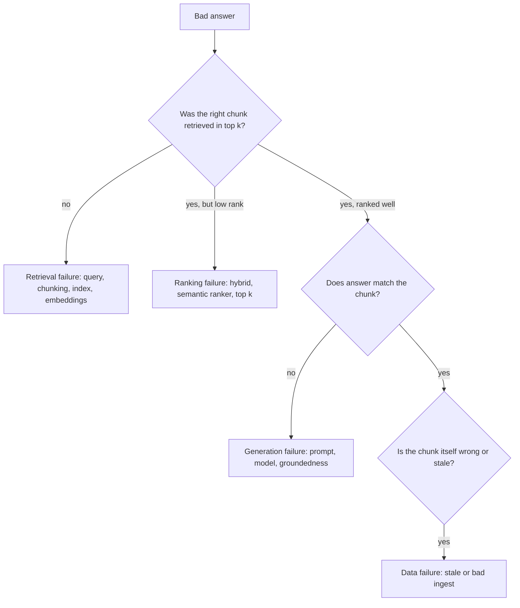

## Day 7: RAG Quality, Index Health, Grounding Evaluation and the Week 1 Checkpoint

### 1. Day at a Glance

| Item | Value |
|---|---|
| Weekday / time | Sunday, 270 min planned |
| Status | Not Started |
| Difficulty | 4/5 |
| Objectives | D2-02, D2-04, D1-10, D1-11, D1-03, D5-02 |
| Label | Exam Essential |
| Resources created | None |
| Estimated cost | about EUR 0.50 (evaluator calls use model tokens) |
| Lab | [Lab 05](../labs/lab-05-rag-ai-search.md) (part 2) |
| Capstone milestone | M5 grounded answer with citations and an evaluation set |

### 2. Why This Matters

A RAG demo that "seems fine" is not a solution. The study guide asks you to detect fabrications, measure relevance and monitor index health. Today you turn yesterday's pipeline into something you can measure and trust, then check Week 1.

### 3. Prerequisites

[Day 6](day-06.md) complete: index populated, `retrieve.py`, `answer.py`, `qa.jsonl` with 10 questions.

### 4. Learning Outcomes

- Compute hit@k and MRR for each search mode.
- Run groundedness and relevance evaluators over RAG outputs.
- Build an index health report and interpret it.
- Classify a bad answer as retrieval, ranking, chunking, generation or refusal failure.
- Define production monitoring signals for grounding quality and ingestion.

### 5. Visual Explanation



### 6. Learn

Theory (45 min):

1. **Two layers of RAG metrics** (10 min): *retrieval* (hit@k, MRR, recall) and *generation* (groundedness = stays within context; relevance = answers the question; completeness; coherence/fluency). Read the built-in evaluators page and list which inputs each evaluator needs (query, context, response, ground truth).
2. **Fabrication detection** (8 min): low groundedness on answers with fluent text is the classic fabrication signal. Evaluator scores are model-judged: they are signals, not truth.
3. **Index health and ingestion quality** (10 min): document counts vs expected, failed uploads, empty/duplicate chunks, missing vectors, storage vs tier limit, staleness (last update), query latency, zero-result rate.
4. **Monitoring grounding in production** (7 min): sample live traffic, evaluate offline daily, alert when the rolling groundedness mean drops; track "no answer" and "refused" rates; watch model/version changes as a drift source.
5. **Agentic retrieval overview** (10 min, reading): knowledge bases and sources, model-planned subqueries, how it differs from a single hybrid query (Day 9 uses the idea in an agent tool). Link in Resources.

### 7. Resources

| Study | Link |
|---|---|
| Built-in evaluators | <https://learn.microsoft.com/en-us/azure/foundry/concepts/built-in-evaluators> |
| Observability | <https://learn.microsoft.com/en-us/azure/foundry/concepts/observability> |
| Python evaluation samples | <https://github.com/Azure/azure-sdk-for-python/blob/main/sdk/ai/azure-ai-projects/samples/evaluations/README.md> |
| Agentic retrieval | <https://learn.microsoft.com/en-us/azure/search/agentic-retrieval-overview> |
| Search RAG sample app | <https://github.com/Azure-Samples/azure-search-openai-demo> |

### 8. Hands-On Lab

**Step 1: Retrieval metrics (20 min).** `src\knowledgedesk\evals\retrieval_eval.py`: loop over `qa.jsonl`, run the 4 modes, compute `hit@1`, `hit@4` (does a returned `doc_id` equal the expected one) and MRR (mean of 1/rank, 0 if absent). Print one table. Save to `out\retrieval_metrics.md`.

**Step 2: Answer-quality evaluation (25 min).** Generate answers for the 10 questions with your best mode. Write `out\rag_rows.jsonl` with `query`, `context` (the 4 chunks joined), `response`. Then:

```python
from azure.ai.evaluation import GroundednessEvaluator, RelevanceEvaluator, evaluate
from azure.identity import DefaultAzureCredential

from common.config import require

cfg = {
    "azure_endpoint": require("AZURE_OPENAI_ENDPOINT"),
    "azure_deployment": require("AZURE_AI_MODEL_DEPLOYMENT"),
    "credential": DefaultAzureCredential(),
}
result = evaluate(
    data="out/rag_rows.jsonl",
    evaluators={"groundedness": GroundednessEvaluator(cfg), "relevance": RelevanceEvaluator(cfg)},
    output_path="out/rag_eval.json",
)
print(result["metrics"])
```

Each evaluator is a model call; the 10 rows cost a few cents. Use `.venv311` if the Day 1 gate failed for evaluation. Open `out\rag_eval.json` and list the two lowest-scoring rows.

**Step 3: Index health report (15 min).** `src\knowledgedesk\evals\index_health.py`: print `search_client().get_document_count()`, call `index_client().get_index_statistics(name)` and print storage and vector size against the 50 MB Free limit, compare the document count with the number of chunks your ingest wrote, and sample 10 documents to confirm `content` is non-empty and `embedding` length is 1536. Fail with a non-zero exit code when any check fails.

**Step 4: Top-k and chunking experiment (20 min).** For `top` in 2, 4, 8 compute groundedness over the 10 questions (or a subset of 5 to save cost). Plot nothing; write a 3-line conclusion on the trade-off (more context vs noise and tokens).

**Step 5: Monitoring design (10 min).** In [capstone/TESTING.md](../capstone/TESTING.md) write a "RAG monitoring" table: signal, how measured, threshold, action. Include rolling groundedness, zero-result rate, ingestion failure count, index storage %, latency p95.

**Step 6: Agentic retrieval reading (15 min).** Read the overview. Write 5 lines: when would you use it instead of your hybrid query, what extra cost or setup does it add, what are the limits on Free tier (check the limits page).

**Step 7: Week 1 checkpoint (25 min).** Complete the checkpoint in [week-01/README.md](README.md): quiz + checklist. Update [TRACKER.md](../TRACKER.md).

### 9. Break/Fix Challenge

1. **Stale data.** Edit one source file (change a number), do **not** re-ingest, ask the question. Observe the old answer with a correct-looking citation. Fix: make ingest idempotent (use `merge_or_upload_documents`, delete chunks for a doc before re-adding, track content hash) and re-test.
2. **Fabrication.** Temporarily weaken the prompt to "Answer helpfully", then ask 2 questions not in the corpus. Record the answers and evaluator groundedness. Restore the strict prompt and confirm the "I do not know" behavior and improved scores.
3. **Zero results.** Ask a question with only stop words in `keyword` mode. Note the result and how your answer function should behave (refuse and suggest rephrasing).

### 10. Capstone Progress

M5: `answer.py` returns `{answer, sources, mode}`; eval set (`data/eval/qa.jsonl`), `retrieval_eval.py`, `index_health.py` and the evaluator script exist. Add the "RAG failure taxonomy" diagram above to [capstone/ARCHITECTURE.md](../capstone/ARCHITECTURE.md) or TESTING.md.

### 11. Validation

- [ ] Metrics table shows hit@1, hit@4 and MRR for four modes.
- [ ] Evaluator output file exists with per-row scores.
- [ ] Index health script exits 0 on a healthy index and non-zero when you break something (delete one doc and re-run).
- [ ] Stale-data break/fix resolved by an idempotent ingest.
- [ ] Checkpoint criteria in the Week 1 dashboard all ticked.

### 12. Exam Focus

- Name the evaluators and their inputs: groundedness (context + response), relevance (query + response), retrieval-related ones need context.
- Monitoring: ingestion quality, index health, relevance, grounding drift.
- A grounded wrong answer means a data problem, not a model problem.
- Trap: trusting an LLM judge score as ground truth.

### 13. Review Questions

1. A user gets a fluent wrong answer with a valid citation. Which layer failed? 2. Which signals indicate ingestion problems? 3. What does MRR reward? 4. How do you detect grounding drift over time? 5. Why use `merge_or_upload` and content hashes in ingest?

<details><summary>Answers</summary>

1. Data (stale or incorrect chunk), not retrieval or generation. 2. Failed upload results, count mismatch, empty/duplicate chunks, missing vectors, stale timestamps. 3. Putting the correct result near the top. 4. Track rolling evaluator scores on sampled traffic and alert on drops. 5. To make re-runs idempotent and keep the index consistent with sources.

</details>

### 14. Definition of Done

- [ ] Lab validation passes.
- [ ] Three break/fix cases done.
- [ ] M5 files exist.
- [ ] Week 1 checkpoint completed and recorded.
- [ ] Progress entry, [TRACKER.md](../TRACKER.md) and [COST_TRACKER.md](../COST_TRACKER.md) updated.

### 15. Cleanup

Delete extra indexes created for experiments. Keep the main index. Review spend in Cost Management.

### 16. Progress Entry

| Field | Value |
|---|---|
| Status | Not Started |
| Theory done | |
| Lab done | |
| Break/fix done | |
| Capstone done | |
| Review done | |
| Planned time | 270 min |
| Actual time | |
| Confidence (1-5) | |
| Weak areas | |

### 17. Navigation

Previous: [Day 6](day-06.md) | Next: [Day 8](../week-02/day-08.md) | [Week 1 dashboard](README.md) | [Main README](../README.md) | [Tracker](../TRACKER.md)

### 18. Time Budget

| Block | Minutes |
|---|---|
| Learn | 45 |
| Build and verify (steps 1-7: 20+25+15+20+10+15+25 = 130) | 130 |
| Break/Fix | 35 |
| Verify (re-run all) | 15 |
| Capstone write-up and review | 30 |
| Buffer | 15 |
| **Total** | **270** |
