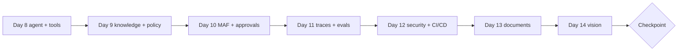

# Week 2 Dashboard: Agents, Operations, Extraction and Vision (Days 8-14)

Goal: an agent with search, ticket and extraction tools, governed by a tool policy, observable in traces, with a document ingestion pipeline and a guarded image path.

## Days

| Day | Weekday | Planned | Topic | Objectives | Lab | Status |
|---|---|---|---|---|---|---|
| [8](day-08.md) | Mon | 75 | Foundry agents and function tools | D2-07/08/03/05, D1-04/07 | [06](../labs/lab-06-foundry-agent-function-tools.md) | Not Started |
| [9](day-09.md) | Tue | 75 | Agent knowledge, MCP, tool policy | D2-08/09, D5-05, D1-02/04/16 | [07](../labs/lab-07-agent-knowledge-and-mcp.md) | Not Started |
| [10](day-10.md) | Wed | 75 | Agent Framework, multi-agent, approvals | D2-10/11/16, D1-15/16 | [08](../labs/lab-08-agent-framework-multi-agent.md) | Not Started |
| [11](day-11.md) | Thu | 75 | Observability and agent evaluation | D2-12/15, D1-10/14/15 | [09](../labs/lab-09-tracing-and-evaluation.md) | Not Started |
| [12](day-12.md) | Fri | 75 | Security, networking, CI/CD, quotas | D1-05/06/08/09/12/15 | [10](../labs/lab-10-security-and-cicd.md) | Not Started |
| [13](day-13.md) | Sat | 270 | Document extraction and enrichment | D5-01/03/04/06/07/08 | [11](../labs/lab-11-document-extraction.md) | Not Started |
| [14](day-14.md) | Sun | 270 | Vision understanding and visual safety | D3-06 to D3-16 | [12](../labs/lab-12-vision-understanding.md) | Not Started |

Planned total: 5 x 75 + 2 x 270 = 915 min. Domain mix: roughly 40% generative AI and agents, 20% plan/manage, 20% extraction, 20% vision.

## Weekly diagram

## Checkpoint (Day 14)

### Readiness checklist (pass = all ticked)

- [ ] Agent calls `search_knowledge`, `get_ticket_status` and `create_ticket` correctly in at least 6 of 8 cases in `agent_cases.jsonl`.
- [ ] `create_ticket` is blocked until approved, in both Foundry-agent and MAF versions.
- [ ] Traces visible in Application Insights; one slow-span diagnosis performed.
- [ ] Identity matrix and network design written; `gate.py` blocks a bad evaluation.
- [ ] Documents (PDF and scan) ingested; low-confidence extractions flagged.
- [ ] Poisoned image blocked before the model call.
- [ ] Cumulative spend under EUR 12 ([COST_TRACKER.md](../COST_TRACKER.md)).
- [ ] Weak areas from Week 1 revisited (see [week-01/README.md](../week-01/README.md)).

### Self-quiz (12 questions, 25 minutes, no notes)

1. Name three components of an agent definition.
2. What does `strict` plus `additionalProperties: false` achieve in a tool schema?
3. Why must tool policy be enforced in code?
4. What is `allowed_tools` for on an MCP tool?
5. When is multi-agent justified?
6. What does a span carry that a log line usually does not?
7. Which three controls would you add to an autonomous agent loop?
8. What is the recommended identity for CI to Azure without stored secrets?
9. What makes Free Search a poor choice for a private-network design?
10. When do you pick Content Understanding over a prebuilt Document Intelligence model?
11. Why OCR images before sending them to a model in a guarded pipeline?
12. What should happen to extractions with confidence below your threshold?

Answers

1. Model, instructions, tools (also state/conversation). 2. Forces arguments to match the schema exactly (no extra or missing fields). 3. The model can be talked out of prompt rules; code is deterministic. 4. Restricts which server tools the agent may call. 5. When instructions, tools, context or permissions are better separated by role. 6. Timing, parent/child relation, attributes such as tokens and tool names. 7. Iteration limit, time/budget limit, approval for risky tools (also allowlist and audit). 8. Federated workload identity (OIDC). 9. It does not support private endpoints. 10. Custom schemas, mixed media, or model-based reasoning on content. 11. Embedded text can carry indirect prompt injection. 12. Route to human review and record the rate.

Scoring: 11-12 strong; 9-10 acceptable; under 9 means use Day 15's first 20 minutes to repair the weakest topic and note it in [WEAK_AREAS](../exam-prep/WEAK_AREAS.md).

## Weak-area log

| Topic | Days to revisit | Fixed? |
|---|---|---|
| | | |

## Links

[Main README](../README.md) | [Tracker](../TRACKER.md) | [Week 1](../week-01/README.md) | [Week 3](../week-03/README.md) | [Catch-up plan](../CATCH_UP_PLAN.md)
