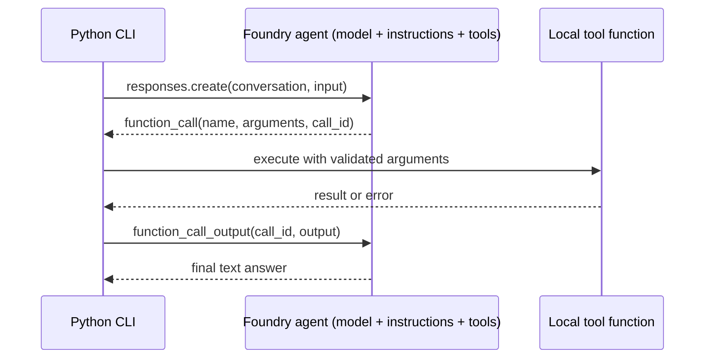

## Day 8: Foundry Agents and Function Tools

### 1. Day at a Glance

| Item | Value |
|---|---|
| Weekday / time | Monday, 75 min planned |
| Status | Not Started |
| Difficulty | 4/5 |
| Objectives | D2-07, D2-08, D2-03, D2-05, D1-04, D1-07 |
| Label | Exam Essential |
| Resources created | One agent (versioned) in your Foundry project |
| Estimated cost | about EUR 0.30 |
| Lab | [Lab 06](../labs/lab-06-foundry-agent-function-tools.md) |
| Capstone milestone | M6 (part 1): agent with function tools |

### 2. Why This Matters

"Build agents by using Foundry" is the second block of the heaviest domain. You are tested on roles and goals, how conversations are tracked, tool schemas, and combining retrieval with function calls.

### 3. Prerequisites

[Day 7](../week-01/day-07.md): working `answer.py`/`retrieve.py`, safety gate, wrappers.

### 4. Learning Outcomes

- Define an agent with a role, a goal, constraints and tools.
- Write JSON-schema tool definitions and implement the local functions.
- Run the tool-calling loop with a safe iteration limit.
- Track conversation state with a conversation ID and explain what is and is not remembered.
- Create a new agent version and list versions.

### 5. Visual Explanation



### 6. Learn

Theory (15 min):

1. **What an agent is** (4 min): a model plus instructions plus tools plus state. Compare a plain chat call (Day 2) to an agent: the agent decides whether to call tools, and may loop.
2. **Agent kinds** (3 min): prompt agents (defined by configuration, stored as versioned definitions), hosted agents (your code packaged, for example with Agent Framework, Day 10), and ephemeral agents via the Responses API. Skim the agents overview page.
3. **Tool schemas** (4 min): name, description, JSON-schema parameters, required fields. Descriptions are prompts: vague descriptions cause wrong tool choice.
4. **Conversation tracking and memory** (4 min): a conversation object holds turn history; a new conversation forgets. Long-term memory features exist in the platform; read the overview to know they exist and that they are a separate decision (cost, privacy, retention).

### 7. Resources

| Study | Link |
|---|---|
| Foundry agents overview | <https://learn.microsoft.com/en-us/azure/foundry/agents/overview> |
| Function calling tool | <https://learn.microsoft.com/en-us/azure/foundry/agents/how-to/tools/function-calling> |
| Learn modules | `develop-ai-agents-azure-vs-code`, `build-agent-with-custom-tools` in [RESOURCES.md](../RESOURCES.md) |
| Lab repo (agents) | <https://github.com/MicrosoftLearning/mslearn-ai-agents> |

### 8. Hands-On Lab

Always compare the snippets with the function-calling page; the SDK 2.x surface is new.

**Step 1: Tools and agent definition (12 min).** `src\knowledgedesk\tools.py`:

```python
import json
from pathlib import Path

TICKETS = Path("out/tickets.json")


def _load() -> dict:
    if TICKETS.exists():
        return json.loads(TICKETS.read_text())
    return {"T-1001": {"status": "open", "summary": "Double charge"}, "T-1002": {"status": "closed", "summary": "Login issue"}}


def get_ticket_status(ticket_id: str) -> dict:
    ticket = _load().get(ticket_id)
    return ticket if ticket else {"error": f"Ticket {ticket_id} not found"}


def create_ticket(summary: str, urgency: int) -> dict:
    data = _load()
    new_id = f"T-{1000 + len(data) + 1}"
    data[new_id] = {"status": "open", "summary": summary, "urgency": urgency}
    TICKETS.parent.mkdir(exist_ok=True)
    TICKETS.write_text(json.dumps(data))
    return {"ticket_id": new_id}


TOOLS = {"get_ticket_status": get_ticket_status, "create_ticket": create_ticket}
```

`src\knowledgedesk\agent.py` (create once):

```python
from azure.ai.projects.models import FunctionTool, PromptAgentDefinition

from common.config import require
from knowledgedesk.foundry_client import get_clients

INSTRUCTIONS = (
    "You are KnowledgeDesk support assistant. Goal: resolve ticket questions accurately. "
    "Use get_ticket_status for status questions. Use create_ticket only when the user explicitly asks to open a ticket. "
    "If a tool returns an error, say so; never invent ticket data."
)

status_tool = FunctionTool(
    name="get_ticket_status",
    description="Look up the status of an existing support ticket by its ID (format T-1234).",
    parameters={
        "type": "object",
        "properties": {"ticket_id": {"type": "string", "description": "Ticket ID like T-1001"}},
        "required": ["ticket_id"],
        "additionalProperties": False,
    },
    strict=True,
)
create_tool = FunctionTool(
    name="create_ticket",
    description="Create a new support ticket. Only call when the user explicitly asks to open one.",
    parameters={
        "type": "object",
        "properties": {
            "summary": {"type": "string"},
            "urgency": {"type": "integer", "description": "1 low to 5 critical"},
        },
        "required": ["summary", "urgency"],
        "additionalProperties": False,
    },
    strict=True,
)

if __name__ == "__main__":
    project, _ = get_clients()
    agent = project.agents.create_version(
        agent_name="kd-agent",
        definition=PromptAgentDefinition(
            model=require("AZURE_AI_MODEL_DEPLOYMENT"), instructions=INSTRUCTIONS, tools=[status_tool, create_tool]
        ),
    )
    print(agent.name, agent.version)
```

If the constructor rejects `strict` or the parameter shape, follow the function-calling page.

**Step 2: Run the loop (12 min).** `src\labs\lab06_agent_loop.py`:

```python
import json

from knowledgedesk.foundry_client import get_clients
from knowledgedesk.tools import TOOLS

MAX_STEPS = 5
project, _ = get_clients()
client = project.get_openai_client(agent_name="kd-agent")  # verify against the agents quickstart
conv = client.conversations.create()


def turn(text: str) -> str:
    resp = client.responses.create(conversation=conv.id, input=text)
    for _ in range(MAX_STEPS):
        calls = [item for item in resp.output if item.type == "function_call"]
        if not calls:
            return resp.output_text
        outputs = []
        for call in calls:
            try:
                result = TOOLS[call.name](**json.loads(call.arguments))
            except Exception as exc:  # return the error to the model instead of crashing
                result = {"error": str(exc)}
            outputs.append({"type": "function_call_output", "call_id": call.call_id, "output": json.dumps(result)})
        resp = client.responses.create(conversation=conv.id, input=outputs)
    return "Stopped: too many tool steps."


print(turn("What is the status of ticket T-1001?"))
print(turn("And the other one, T-1002?"))
print(turn("Open a ticket: printer on floor 2 is down, medium urgency."))
```

**Step 3: Memory test (5 min).** Ask "What was the first ticket I asked about?" in the same conversation (should answer). Start a new conversation and ask again (should not know). Note the difference in your notes.

**Step 4: Versions and portal (5 min).** Change one sentence in `INSTRUCTIONS`, run `agent.py` again, then list versions with `project.agents.list_versions(agent_name="kd-agent")` and confirm the new version in the portal.

**Step 5: Notes (6 min).** In [capstone/ARCHITECTURE.md](../capstone/ARCHITECTURE.md) add the agent/tool interaction sequence diagram above with your tool names.

### 9. Break/Fix Challenge

1. **Schema mismatch.** Rename the `ticket_id` property to `id` in the tool schema only. Run. Expected: `TypeError`/error JSON returned to the model. Fix the schema or the function and note why the error was returned instead of crashing.
2. **Runaway loop.** Make `get_ticket_status` always return `{"error": "retry"}` and ask for a status. Verify `MAX_STEPS` stops the loop. Restore.
3. **Wrong tool choice.** Remove "Only call when the user explicitly asks" from the create tool description and ask "My printer is broken, what should I do?". Observe an unwanted `create_ticket`; restore the guardrail text.

### 10. Capstone Progress

M6 part 1: `tools.py`, `agent.py`, the loop in `lab06_agent_loop.py` (move it into `knowledgedesk/agent_runner.py`). Today's agent has ticket tools; Day 9 adds the search tool.

### 11. Validation

- [ ] Status question triggers `get_ticket_status` and returns the stored status.
- [ ] Create request produces a new entry in `out\tickets.json`.
- [ ] A new conversation does not recall the earlier one.
- [ ] Loop stops after `MAX_STEPS` in break/fix 2.
- [ ] Agent shows at least two versions.

### 12. Exam Focus

- Agent = model + instructions + tools + conversation state.
- Tool descriptions steer selection; schemas validate arguments.
- Conversation tracking approach: conversation IDs vs resending history vs memory stores.
- Always bound the tool loop and return errors to the model in a controlled way.

### 13. Review Questions

1. Why are tool descriptions security-relevant? 2. How does the agent "remember" within a session? 3. What is the purpose of `required` and `additionalProperties: false`? 4. What belongs in instructions versus tool descriptions? 5. What is a prompt agent version good for?

<details><summary>Answers</summary>

1. They determine when risky tools get called. 2. A conversation object (or response chaining) holds prior turns. 3. They constrain arguments so the model cannot omit or invent fields. 4. Instructions: role, goal, global rules; tool descriptions: when and how to use that specific tool. 5. Controlled rollout, comparison and rollback of behavior.

</details>

### 14. Definition of Done

- [ ] Lab validation passes.
- [ ] Three break/fix cases done.
- [ ] Capstone files moved into `knowledgedesk/`.
- [ ] Progress entry and tracker updated.

### 15. Cleanup

Keep the agent. If you create many throwaway versions, delete extras with the delete-version call listed in the SDK (`project.agents.delete_version`) or in the portal.

### 16. Progress Entry

| Field | Value |
|---|---|
| Status | Not Started |
| Theory done | |
| Lab done | |
| Break/fix done | |
| Capstone done | |
| Review done | |
| Planned time | 75 min |
| Actual time | |
| Confidence (1-5) | |
| Weak areas | |

### 17. Navigation

Previous: [Day 7](../week-01/day-07.md) | Next: [Day 9](day-09.md) | [Week 2 dashboard](README.md) | [Main README](../README.md) | [Tracker](../TRACKER.md)

### 18. Time Budget

| Block | Minutes |
|---|---|
| Learn | 15 |
| Build (steps 1-5: 12+12+5+5+6) | 40 |
| Break/Fix | 10 |
| Verify | 5 |
| Review and progress entry | 5 |
| **Total** | **75** |
