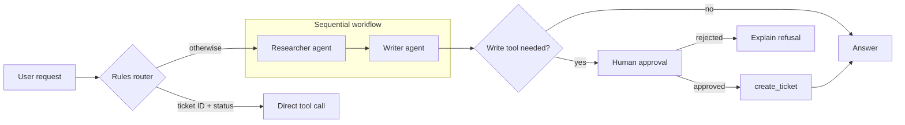

## Day 10: Microsoft Agent Framework, Multi-Agent Orchestration and Approvals

### 1. Day at a Glance

| Item | Value |
|---|---|
| Weekday / time | Wednesday, 75 min planned |
| Status | Not Started |
| Difficulty | 4/5 |
| Objectives | D2-10, D2-11, D2-16, D2-03, D1-15, D1-16 |
| Label | Exam Essential for the concepts (multi-agent, approvals, hybrid routing); the framework itself is Supporting Knowledge and AI-500 Foundation |
| Resources created | None |
| Estimated cost | about EUR 0.50 |
| Lab | [Lab 08](../labs/lab-08-agent-framework-multi-agent.md) |
| Capstone milestone | M7 multi-agent flow with approval |

### 2. Why This Matters

The study guide says "implement orchestrated multi-agent solutions" and "approval flow controls" under "Build agents by using Foundry". It does not name Microsoft Agent Framework (MAF), but MAF is an official hosted-agent option in Foundry, is covered by the official AI-103T00 course modules, and is named in AI-500. Treat the **concepts** as exam essential and the **API** as supporting.

### 3. Prerequisites

[Day 9](day-09.md). Python async primer from [Day 4](../week-01/day-04.md). `agent-framework` installed (Day 1).

### 4. Learning Outcomes

- Build an `Agent` with Python function tools and a session.
- Require human approval for a tool and handle the approval round-trip.
- Chain two agents with a sequential workflow.
- Choose among sequential, concurrent, group-chat, handoff and magentic patterns.
- Combine deterministic rules with an LLM (hybrid routing).

### 5. Visual Explanation



### 6. Learn

Theory (15 min):

1. **MAF in context** (3 min): an open-source SDK for agents and workflows; Python package `agent-framework`; Foundry integration via `agent_framework.foundry.FoundryChatClient`. Read the overview page. Foundry prompt agents (Day 8) need no code framework; MAF gives code-level control and local orchestration.
2. **Pattern catalogue** (6 min): *sequential* (pipeline), *concurrent* (fan-out/fan-in), *group chat* (agents take turns under a manager), *handoff* (control passes to the best specialist), *magentic* (a planner builds and tracks a task list). Rule of thumb: start with **one agent with tools**; split into several only when instructions conflict, context grows too large, or roles need different tools or permissions.
3. **Approvals and autonomy** (3 min): approval mode on a tool pauses the run and surfaces a request; the app (or a person) approves or rejects. Autonomy levels: fully manual, approve-risky, autonomous with limits. Always add iteration, time and budget limits.
4. **Hybrid LLM and rules** (3 min): deterministic rules for things you can specify (ID formats, thresholds, allowlists); the LLM for ambiguous language. Cheaper, faster, more testable.

### 7. Resources

| Study | Link |
|---|---|
| Agent Framework overview | <https://learn.microsoft.com/en-us/agent-framework/overview/> |
| Agents | <https://learn.microsoft.com/en-us/agent-framework/agents/> |
| Function tools | <https://learn.microsoft.com/en-us/agent-framework/agents/tools/function-tools> |
| Workflows | <https://learn.microsoft.com/en-us/agent-framework/workflows/> |
| Repository and samples | <https://github.com/microsoft/agent-framework> |
| Learn modules | `develop-ai-agent-with-semantic-kernel`, `orchestrate-semantic-kernel-multi-agent-solution` (titles mention Semantic Kernel; the catalog notes cover Agent Framework), `build-agent-workflows-microsoft-foundry`, `discover-agents-with-a2a` (reading) in [RESOURCES.md](../RESOURCES.md) |

### 8. Hands-On Lab

If an import or call fails, compare with the function-tools and workflows pages; MAF moves fast. Use `print(obj)` to inspect unfamiliar objects.

**Step 1: Agent with tool and session (10 min).** `src\labs\lab08_maf_agent.py`:

```python
import asyncio
from typing import Annotated

from agent_framework import Agent
from agent_framework.foundry import FoundryChatClient
from azure.identity import DefaultAzureCredential
from pydantic import Field

from common.config import require
from knowledgedesk.tools import get_ticket_status as _status


def get_ticket_status(ticket_id: Annotated[str, Field(description="Ticket ID like T-1001")]) -> str:
    """Look up the status of a support ticket."""
    return str(_status(ticket_id))


async def main() -> None:
    client = FoundryChatClient(
        project_endpoint=require("AZURE_AI_PROJECT_ENDPOINT"),
        model=require("AZURE_AI_MODEL_DEPLOYMENT"),
        credential=DefaultAzureCredential(),
    )
    agent = Agent(client, instructions="You are a support assistant. Use tools; never invent data.", name="support", tools=[get_ticket_status])
    session = agent.create_session()
    print((await agent.run("Status of T-1001?", session=session)).text)
    print((await agent.run("And T-1002?", session=session)).text)


asyncio.run(main())
```

MAF does not load `.env` by itself; `common.config` already calls `load_dotenv()`.

**Step 2: Approval flow (10 min).** Add a write tool with approval and handle the round trip:

```python
from agent_framework import Message, tool


@tool(approval_mode="always_require")
def create_ticket(
    summary: Annotated[str, Field(description="Short problem summary")],
    urgency: Annotated[int, Field(description="1 low to 5 critical")],
) -> str:
    """Create a support ticket."""
    from knowledgedesk.tools import create_ticket as _create
    return str(_create(summary, urgency))

# agent = Agent(..., tools=[get_ticket_status, create_ticket])
result = await agent.run("Open a ticket: printer down, urgency 3", session=session)
while result.user_input_requests:
    replies = []
    for req in result.user_input_requests:
        approved = input(f"Approve this call? {req} (y/n) ").strip().lower() == "y"
        replies.append(Message("user", [req.to_function_approval_response(approved)]))
    result = await agent.run(replies, session=session)
print(result.text)
```

Append every decision to `out\audit.jsonl` (same format as Day 9).

**Step 3: Sequential workflow (8 min).**

```python
from agent_framework.orchestrations import SequentialBuilder

researcher = Agent(client, instructions="List 3 key facts that answer the question. Facts only.", name="researcher")
writer = Agent(client, instructions="Write a 3-sentence answer using only the facts you are given.", name="writer")
workflow = SequentialBuilder(participants=[researcher, writer]).build()
result = await workflow.run("Why use hybrid search instead of vector search alone?")
for output in result.get_outputs():
    print(output)
```

**Step 4: Hybrid router (7 min).**

```python
import re

TICKET_ID = re.compile(r"\bT-\d{4}\b")


def route(question: str) -> str:
    if TICKET_ID.search(question) and "status" in question.lower():
        return "rule"
    return "llm"
```

For `"rule"`, call `get_ticket_status` directly with no model call; otherwise send the question to the agent. Count the model calls saved over 5 test questions.

**Step 5: A2A reading (5 min).** Skim the A2A module intro. Write three lines: what A2A solves that function tools do not, one security concern, why it is AI-500 material.

### 9. Break/Fix Challenge

1. **Missing await.** Remove `await` before `agent.run(...)` in step 1. Read the warning/error, fix.
2. **Approval bypass by configuration.** Change `approval_mode` to `"never_require"` and rerun. Confirm the ticket is created without a prompt, then restore. Write the lesson: control lives in tool configuration, not in the prompt.
3. **Pipeline hallucination.** Make the researcher instructions "be creative". The writer will repeat invented facts. Fix by adding a third agent that must delete any fact not supported by a provided source, or by restricting the researcher to tool results.

### 10. Capstone Progress

M7: `src/knowledgedesk/maf_flow.py` with the hybrid router, the sequential flow (researcher over `search_knowledge`, writer with citations) and the approval-gated `create_ticket`. Update the capstone architecture diagram for the agent and tool interaction.

### 11. Validation

- [ ] Two-turn session remembers context.
- [ ] Ticket creation pauses until you answer `y`; `n` yields a refusal explanation.
- [ ] Sequential workflow prints a final answer from the writer.
- [ ] Router avoids model calls on rule-matching questions (count recorded).
- [ ] Audit log contains approval decisions.

### 12. Exam Focus

- Decide when multi-agent is justified; name the patterns and their trade-offs.
- Approval flows and autonomy limits are governance controls (D1-16, D2-11).
- Hybrid LLM and rules reduces cost and raises predictability (D2-16).
- Trap: assuming more agents means better answers.

### 13. Review Questions

1. When should you stay with a single agent? 2. What is the difference between concurrent and group-chat patterns? 3. Where is approval configured in MAF function tools? 4. Give two examples of rules to keep out of the LLM. 5. How do you stop an autonomous loop from running away?

<details><summary>Answers</summary>

1. When one set of instructions and tools covers the task. 2. Concurrent runs agents in parallel on the same input and merges; group chat has agents take turns under a manager. 3. On the tool (`approval_mode`). 4. Format validation, permission checks, thresholds, allowlists. 5. Iteration/time/budget limits and approval for risky tools.

</details>

### 14. Definition of Done

- [ ] Lab validation passes.
- [ ] Three break/fix cases done.
- [ ] `maf_flow.py` exists.
- [ ] A2A notes written.
- [ ] Progress entry and tracker updated.

### 15. Cleanup

Nothing to delete.

### 16. Progress Entry

| Field | Value |
|---|---|
| Status | Not Started |
| Theory done | |
| Lab done | |
| Break/fix done | |
| Capstone done | |
| Review done | |
| Planned time | 75 min |
| Actual time | |
| Confidence (1-5) | |
| Weak areas | |

### 17. Navigation

Previous: [Day 9](day-09.md) | Next: [Day 11](day-11.md) | [Week 2 dashboard](README.md) | [Main README](../README.md) | [Tracker](../TRACKER.md)

### 18. Time Budget

| Block | Minutes |
|---|---|
| Learn | 15 |
| Build (steps 1-5: 10+10+8+7+5) | 40 |
| Break/Fix | 10 |
| Verify | 5 |
| Review and progress entry | 5 |
| **Total** | **75** |
