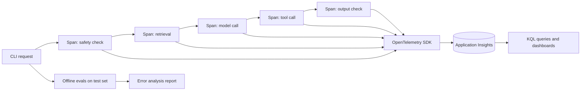

## Day 11: Observability, Tracing, Agent Evaluation and Error Analysis

### 1. Day at a Glance

| Item | Value |
|---|---|
| Weekday / time | Thursday, 75 min planned |
| Status | Not Started |
| Difficulty | 4/5 |
| Objectives | D2-12, D2-15, D1-10, D1-14, D1-15, D2-04 |
| Label | Exam Essential |
| Resources created | Application Insights (workspace-based) |
| Estimated cost | about EUR 0.70 (telemetry plus evaluation calls) |
| Lab | [Lab 09](../labs/lab-09-tracing-and-evaluation.md) |
| Capstone milestone | M8 tracing and evaluation pipeline |

### 2. Why This Matters

You cannot operate or improve what you cannot see. The study guide asks for tracing, token analytics, safety signals, latency breakdowns, error analysis and auditing with provenance metadata.

### 3. Prerequisites

[Day 10](day-10.md). Application Insights needs an Azure Monitor workspace; the portal creates one for you.

### 4. Learning Outcomes

- Enable OpenTelemetry tracing locally and in Application Insights.
- Add custom spans with token and latency attributes.
- Query traces and compute latency and token summaries.
- Evaluate an agent against test cases and classify failures.
- Attach provenance metadata to answers.

### 5. Visual Explanation



### 6. Learn

Theory (15 min):

1. **Traces, spans, metrics, logs** (4 min): one request is a trace; each step is a span with attributes (model, tokens, latency, tool name). .NET analogy: `Activity` and `ActivitySource`.
2. **What Foundry offers** (4 min): read the observability page: tracing with OpenTelemetry into Application Insights, built-in evaluators (for example coherence, fluency, groundedness, relevance, safety, tool call accuracy, task completion), and monitoring. Note billing: playground and risk-and-safety evaluations may bill on consumption.
3. **Privacy** (3 min): by default avoid recording prompt and response content; sensitive-data capture is an explicit opt-in. Never turn it on in shared telemetry.
4. **Error analysis** (4 min): collect failures, label with categories (wrong tool, bad args, no tool, hallucination, wrong refusal, unsafe output, latency, cost), count them, fix the most frequent first, add a regression test.

### 7. Resources

| Study | Link |
|---|---|
| Observability in Foundry | <https://learn.microsoft.com/en-us/azure/foundry/concepts/observability> |
| Built-in evaluators | <https://learn.microsoft.com/en-us/azure/foundry/concepts/built-in-evaluators> |
| Azure Monitor OpenTelemetry (Python tab) | <https://learn.microsoft.com/en-us/azure/azure-monitor/app/opentelemetry-enable> |
| Evaluation samples | <https://github.com/Azure/azure-sdk-for-python/blob/main/sdk/ai/azure-ai-projects/samples/evaluations/README.md> |

### 8. Hands-On Lab

**Step 1: Application Insights (6 min).** Portal -> create Application Insights (workspace-based) in `rg-ai103-prep`. Copy the **connection string** to `APPLICATIONINSIGHTS_CONNECTION_STRING`. In Log Analytics settings set a **daily cap** (for example 0.1 GB) to bound cost.

**Step 2: Custom spans and export (10 min).** `src\knowledgedesk\telemetry.py`:

```python
from azure.monitor.opentelemetry import configure_azure_monitor
from opentelemetry import trace

from common.config import require


def init() -> trace.Tracer:
    configure_azure_monitor(connection_string=require("APPLICATIONINSIGHTS_CONNECTION_STRING"))
    return trace.get_tracer("knowledgedesk")
```

Wrap pipeline stages:

```python
tracer = init()
with tracer.start_as_current_span("rag.answer") as span:
    span.set_attribute("kd.mode", "hybrid")
    with tracer.start_as_current_span("rag.retrieve"):
        hits = search(...)
    with tracer.start_as_current_span("rag.generate") as gen:
        text = ask(...)
        gen.set_attribute("kd.tokens", used_tokens)
```

Run 10 requests, then open Application Insights -> Transaction search / Logs after a few minutes. Spans of internal operations typically appear in the `dependencies` table; check which table your spans land in.

**Step 3: Framework tracing locally (6 min).** For the MAF script from Day 10 add, before building the agent:

```python
from agent_framework.observability import configure_otel_providers

configure_otel_providers(enable_console_exporters=True)  # spans printed to the console; do not combine with step 2 in one process
```

Keep sensitive data capture **off** (default). Observe span names for agent invocation, model call and tool call.

**Step 4: Agent evaluation harness (10 min).** Create `data\eval\agent_cases.jsonl` with 8 cases: `{"input": "...", "expected_tool": "get_ticket_status" | "search_knowledge" | "create_ticket" | null, "must_contain": [...], "must_not_contain": [...]}`. Include a no-tool case, a refusal case and an injection case. `src\knowledgedesk\evals\agent_eval.py` runs each case through the Day 8 loop, records the tools actually called, the final text, tokens and latency, and prints pass/fail per rule. Save `out\agent_eval.json`.

**Step 5: Analysis and provenance (8 min).** Produce a failure table (category, count, example). Add a provenance dict to every answer record: `{model_deployment, agent_name, agent_version, prompt_version, index_name, source_ids, safety_decisions, timestamp}` and write it to `out\answers.jsonl`.

### 9. Break/Fix Challenge

1. **Silent telemetry.** Set a wrong connection string. Nothing appears in Application Insights and nothing crashes. Diagnose by switching to console exporters (step 3) to prove spans are produced, then fix the connection string.
2. **Slow tool.** Add `time.sleep(2)` in `get_ticket_status`. Find the slow span in the trace without reading code. Remove the sleep. Record how you identified it.
3. **Privacy check.** Search your telemetry for any raw ticket text or secrets. If any appears, remove it from attributes and set a rule in [capstone/SECURITY.md](../capstone/SECURITY.md) about what may be logged.

### 10. Capstone Progress

M8: `telemetry.py`, `agent_eval.py`, `agent_cases.jsonl`, provenance records. Update [capstone/TESTING.md](../capstone/TESTING.md) with the agent evaluation plan and the error taxonomy.

### 11. Validation

- [ ] 10 traces visible in Application Insights with child spans.
- [ ] Token and latency attributes present on the model-call spans.
- [ ] `agent_eval.json` shows pass/fail per case; at least one failure analyzed.
- [ ] Provenance JSON written for each answer.
- [ ] Daily cap set on the workspace.

### 12. Exam Focus

- Tracing: OpenTelemetry, Application Insights, correlation across steps.
- Evaluation types: quality (groundedness, relevance), safety, agent-specific (tool call accuracy, task completion).
- Observability data can contain sensitive content; capture deliberately.
- Auditing: trace logs plus provenance metadata plus approvals.

### 13. Review Questions

1. What is the difference between a trace and a span? 2. Name three attributes you would add to a model-call span. 3. Why can a wrong connection string go unnoticed? 4. Which evaluator checks that the agent chose the correct tool? 5. What does provenance metadata let you answer later?

<details><summary>Answers</summary>

1. A trace is a request path; spans are its steps. 2. Model/deployment, input and output tokens, latency (also finish reason, prompt version). 3. Exporters fail quietly; you only notice absent data. 4. A tool-call-accuracy style evaluator (or your own harness). 5. Which model, prompt, agent version and sources produced a given answer.

</details>

### 14. Definition of Done

- [ ] Lab validation passes.
- [ ] Three break/fix cases done.
- [ ] Failure table in TESTING.md.
- [ ] Progress entry and tracker updated.

### 15. Cleanup

Keep Application Insights until Day 21 with the daily cap on. Remove any evaluation or tracing features that bill and that you do not need.

### 16. Progress Entry

| Field | Value |
|---|---|
| Status | Not Started |
| Theory done | |
| Lab done | |
| Break/fix done | |
| Capstone done | |
| Review done | |
| Planned time | 75 min |
| Actual time | |
| Confidence (1-5) | |
| Weak areas | |

### 17. Navigation

Previous: [Day 10](day-10.md) | Next: [Day 12](day-12.md) | [Week 2 dashboard](README.md) | [Main README](../README.md) | [Tracker](../TRACKER.md)

### 18. Time Budget

| Block | Minutes |
|---|---|
| Learn | 15 |
| Build (steps 1-5: 6+10+6+10+8) | 40 |
| Break/Fix | 10 |
| Verify | 5 |
| Review and progress entry | 5 |
| **Total** | **75** |
