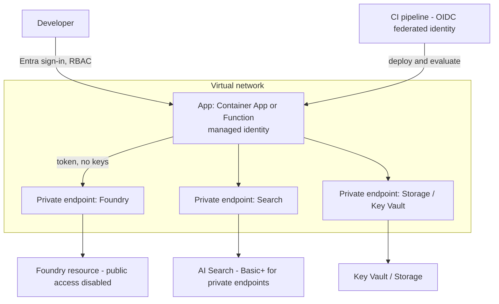

## Day 12: Security, Networking, CI/CD, Quotas and Governance

### 1. Day at a Glance

| Item | Value |
|---|---|
| Weekday / time | Friday, 75 min planned |
| Status | Not Started |
| Difficulty | 3/5 |
| Objectives | D1-05, D1-06, D1-08, D1-09, D1-12, D1-15 |
| Label | Exam Essential (design-heavy; little can be deployed on a free budget) |
| Resources created | None |
| Estimated cost | EUR 0 |
| Lab | [Lab 10](../labs/lab-10-security-and-cicd.md) |
| Capstone milestone | M9 security and deployment design |

### 2. Why This Matters

About a quarter of the exam sits in plan-and-manage. Most of those questions are scenario and design questions: which identity, which network control, how do you gate a release, what do you do about capacity. Private networking and CI/CD are hard to run on EUR 25, so you will reason with diagrams and small runnable gates.

### 3. Prerequisites

[Day 11](day-11.md). Cumulative spend should be under EUR 6; check [COST_TRACKER.md](../COST_TRACKER.md).

### 4. Learning Outcomes

- Choose identity types and roles using least privilege.
- Design a private-network topology and name the pieces involved.
- Design a CI/CD pipeline with an evaluation gate.
- Size capacity and apply app-level rate limiting and caching.
- Explain deployment options for the CLI app (local, container, function, hosted agent).

### 5. Visual Explanation



### 6. Learn

Theory (15 min):

1. **Identity** (4 min): user identity for dev, **managed identity** for Azure-hosted apps, workload identity/OIDC federation for CI (no stored secrets). Keys are the exception and must be documented. Roles: assign the narrowest data-plane role at the narrowest scope.
2. **Networking** (4 min): public endpoint + firewall rules vs private endpoints + private DNS. Know that the Free Search tier cannot use private endpoints and that outbound managed identity is also limited there (limits page). Read the Foundry private link page and list the resources that need endpoints.
3. **CI/CD for AI apps** (4 min): infra as code (Bicep/Terraform), build, unit tests, **offline evaluation gate** (groundedness, safety, tool accuracy), deploy to staging, smoke test, promote. Evaluations are tests for non-deterministic code. Agent definitions are versioned; promote versions like releases.
4. **Capacity and cost** (3 min): TPM/RPM per deployment, provisioned throughput for predictable load, batch for offline bulk, caching (prompt and response), rate limiting per user, cost alerts.

### 7. Resources

| Study | Link |
|---|---|
| Foundry RBAC | <https://learn.microsoft.com/en-us/azure/foundry/concepts/rbac-foundry> |
| Foundry private link | <https://learn.microsoft.com/en-us/azure/foundry/how-to/configure-private-link> |
| Search security overview | <https://learn.microsoft.com/en-us/azure/search/search-security-overview> |
| Azure RBAC overview | <https://learn.microsoft.com/en-us/azure/role-based-access-control/overview> |
| Quotas and limits | <https://learn.microsoft.com/en-us/azure/foundry/openai/quotas-limits> |
| Deployment types | <https://learn.microsoft.com/en-us/azure/foundry/foundry-models/concepts/deployment-types> |
| Key Vault overview | <https://learn.microsoft.com/en-us/azure/key-vault/general/overview> |

### 8. Hands-On Lab

**Step 1: Identity and secrets audit (10 min).**

```powershell
az role assignment list --resource-group rg-ai103-prep --query "[].{who:principalName,role:roleDefinitionName,scope:scope}" -o table
```

In [capstone/SECURITY.md](../capstone/SECURITY.md) fill the **identity matrix**: developer, app (managed identity), CI (federated identity), evaluator, with role and scope. Then scan the repository for secrets:

```powershell
Select-String -Path .\src\*.py,.\*.md -Pattern "api[_-]?key\s*=\s*['""][A-Za-z0-9]{16,}" -Recurse
```

Confirm `.env` is ignored with `git check-ignore -v .env`. Optional: consider disabling local (key) authentication on the Foundry resource after confirming keyless works (look up the `disableLocalAuth` setting in the docs first; other resources in this plan, such as Speech, still use keys).

**Step 2: Network design (12 min).** Read the private link page. In [capstone/ARCHITECTURE.md](../capstone/ARCHITECTURE.md) draw the network diagram for the production target (use the diagram above as a start). List: resources needing private endpoints, private DNS zones, how developers reach the services (VPN/bastion/jump host), and what changes for the Free Search tier. Do not deploy.

**Step 3: CI/CD gate (10 min).** Create `src\knowledgedesk\evals\gate.py`:

```python
import json
import sys

THRESHOLD = 4.0  # example gate on a 1-5 scale

metrics = json.load(open("out/rag_eval.json"))["metrics"]
# Inspect your file; key names such as 'groundedness.groundedness' depend on the evaluator version.
scores = {k: v for k, v in metrics.items() if k.startswith("groundedness") and isinstance(v, (int, float))}
print(scores)
if not scores or min(scores.values()) < THRESHOLD:
    sys.exit("Evaluation gate failed")
```

Then write the workflow skeleton (design only; verify action versions and secrets in your own repo) into [capstone/TASKS.md](../capstone/TASKS.md):

```yaml
name: eval-gate
on: [pull_request]
permissions: { id-token: write, contents: read }
jobs:
  eval:
    runs-on: ubuntu-latest
    steps:
      - uses: actions/checkout@v4
      - uses: actions/setup-python@v5
        with: { python-version: "3.14" }
      - run: pip install -r requirements-core.txt azure-ai-evaluation
      - uses: azure/login@v2
        with:
          client-id: ${{ secrets.AZURE_CLIENT_ID }}
          tenant-id: ${{ secrets.AZURE_TENANT_ID }}
          subscription-id: ${{ secrets.AZURE_SUBSCRIPTION_ID }}
      - run: python src/knowledgedesk/evals/run_rag_eval.py && python src/knowledgedesk/evals/gate.py
```

Note which values are secrets, what federated credential the identity needs, and what role the CI identity gets (evaluation needs model access only).

**Step 4: Capacity and rate limit (8 min).** Calculation: 50 concurrent users, 1 request/minute each, 1,500 tokens per request (input + output) -> $50 \times 1500 = 75{,}000$ tokens per minute. Compare with your deployment capacity and the quota page; write the decision (standard + retry, or provisioned) and what you would cache. Then implement a token-bucket limiter `src\common\rate_limit.py` (capacity 10, refill 1/s) and apply it to `ask()`.

### 9. Break/Fix Challenge

1. **Planted secret.** Add `api_key = "abcd1234abcd1234abcd1234"` to a scratch file, run the scan, see it flagged, remove it, and add a pre-commit check idea to SECURITY.md.
2. **Over-broad role.** Imagine the app identity has Owner on the resource group. List what an attacker with that identity could do. Replace it with the narrowest data-plane roles in your matrix.
3. **Gate failure.** Edit a number in `out/rag_eval.json` below the threshold, run `gate.py`, observe the failing exit code, and restore the file.

### 10. Capstone Progress

M9: identity matrix, network design, CI workflow, `gate.py`, `rate_limit.py`. Update [capstone/COSTS.md](../capstone/COSTS.md) with the capacity estimate.

### 11. Validation

- [ ] Identity matrix exists with least-privilege roles.
- [ ] Secret scan returns nothing for real files.
- [ ] Network diagram lists endpoints and DNS.
- [ ] `gate.py` passes on good data and fails on bad data.
- [ ] Capacity calculation recorded.

### 12. Exam Focus

- Managed identity for hosted apps, federated identity for CI, keys as a documented exception.
- Private endpoints require the right tier and DNS; know Search Free limits.
- Evaluation gates in CI; version promotion.
- Quota remedies: retry, caching, provisioned throughput, batch, other regions.

### 13. Review Questions

1. Which identity type avoids storing secrets in a GitHub workflow? 2. What blocks private endpoints on the Free Search tier? 3. What belongs in an AI-app CI gate besides unit tests? 4. When is provisioned throughput justified? 5. Why is Owner a poor role for an app identity?

<details><summary>Answers</summary>

1. OIDC federated workload identity. 2. The tier does not support them (see limits page). 3. Evaluation thresholds on quality and safety metrics. 4. Steady high-volume traffic needing predictable latency/throughput. 5. It grants far more than the app needs (control plane, role assignment), so compromise is costly.

</details>

### 14. Definition of Done

- [ ] Lab validation passes.
- [ ] Three break/fix cases done.
- [ ] SECURITY.md identity matrix complete.
- [ ] Progress entry and tracker updated.

### 15. Cleanup

Nothing deployed. Check that `.env` is not tracked by git.

### 16. Progress Entry

| Field | Value |
|---|---|
| Status | Not Started |
| Theory done | |
| Lab done | |
| Break/fix done | |
| Capstone done | |
| Review done | |
| Planned time | 75 min |
| Actual time | |
| Confidence (1-5) | |
| Weak areas | |

### 17. Navigation

Previous: [Day 11](day-11.md) | Next: [Day 13](day-13.md) | [Week 2 dashboard](README.md) | [Main README](../README.md) | [Tracker](../TRACKER.md)

### 18. Time Budget

| Block | Minutes |
|---|---|
| Learn | 15 |
| Build (steps 1-4: 10+12+10+8) | 40 |
| Break/Fix | 10 |
| Verify | 5 |
| Review and progress entry | 5 |
| **Total** | **75** |
