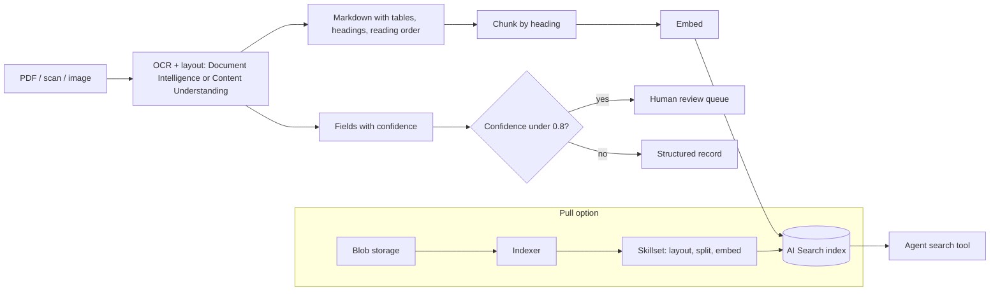

## Day 13: Document Extraction with Document Intelligence, Content Understanding and Enrichment

### 1. Day at a Glance

| Item | Value |
|---|---|
| Weekday / time | Saturday, 270 min planned |
| Status | Not Started |
| Difficulty | 4/5 |
| Objectives | D5-01, D5-03, D5-04, D5-06, D5-07, D5-08, D2-09, D1-11, D3-10, D3-12 (first pass) |
| Label | Exam Essential |
| Resources created | Document Intelligence F0, Content Understanding defaults (on the Foundry resource), optional storage account |
| Estimated cost | about EUR 1.00 (Content Understanding pay-as-you-go; keep to 15 pages) |
| Lab | [Lab 11](../labs/lab-11-document-extraction.md) |
| Capstone milestone | M10 document ingestion (OCR, layout, fields) |

### 2. Why This Matters

Real corpora are PDFs, scans and tables, not clean markdown. Domain 5 asks you to ingest content, use OCR and layout, extract fields, and produce clean grounded representations for agents and RAG with Content Understanding.

### 3. Prerequisites

[Day 12](../week-02/day-12.md) and the Day 6 index. Content Understanding needs model deployments on your Foundry resource (chat model you already have and the embedding model). Spend so far should be under EUR 8.

### 4. Learning Outcomes

- Pick Document Intelligence, Content Understanding or Search skills for a given extraction need.
- Produce layout-aware markdown from a PDF and use headings to chunk.
- Extract fields from an invoice and decide when to route to human review.
- Explain analyzers, prebuilt vs custom, and standard vs pro modes at a high level.
- Describe the indexer, skillset and index-projection pipeline for enrichment.

### 5. Visual Explanation



### 6. Learn

Theory (45 min):

1. **Tool landscape** (10 min). *Document Intelligence*: prebuilt models (read, layout, invoice, receipt, ID and others) and custom models; returns pages, tables, key-value pairs, fields. *Content Understanding*: analyzers that turn documents, images, audio and video into **markdown and structured fields** using models; prebuilt analyzers plus custom analyzers with field schemas. *Search skills*: OCR, document layout, split, embedding and Content Understanding skills inside an indexer pipeline. Write a decision table: fixed standard forms -> prebuilt DI; custom schema across mixed media -> CU; bulk ingestion into a search index -> indexer + skillset.
2. **OCR and layout** (10 min). Why reading order, tables and headings matter for chunking; selection marks; handwriting; confidence. Read the layout model page.
3. **Content Understanding** (15 min). Read overview, document overview, prebuilt analyzers, analyzer reference. Note: needs a Foundry resource with default model deployments; analyzers have field schemas; output includes markdown; modes (single-task analyzers vs pro mode reasoning pipelines); billing explained on the pricing explainer page. Both are pay-as-you-go.
4. **Enrichment pipeline** (10 min). Read the skills concept page and the document layout skill page. Draw: data source -> indexer -> skillset (layout, split, embed) -> index projections -> index. Know that Free tier has a skillset limit and limited enrichment allowance (check the limits page).

### 7. Resources

| Study | Link |
|---|---|
| Document Intelligence overview | <https://learn.microsoft.com/en-us/azure/ai-services/document-intelligence/overview> |
| Layout model | <https://learn.microsoft.com/en-us/azure/ai-services/document-intelligence/prebuilt/layout> |
| Content Understanding overview | <https://learn.microsoft.com/en-us/azure/ai-services/content-understanding/overview> |
| CU documents | <https://learn.microsoft.com/en-us/azure/ai-services/content-understanding/document/overview> |
| CU prebuilt analyzers | <https://learn.microsoft.com/en-us/azure/ai-services/content-understanding/concepts/prebuilt-analyzers> |
| CU analyzer reference | <https://learn.microsoft.com/en-us/azure/ai-services/content-understanding/concepts/analyzer-reference> |
| CU REST quickstart | <https://learn.microsoft.com/en-us/azure/ai-services/content-understanding/quickstart/use-rest-api> |
| CU pricing explainer | <https://learn.microsoft.com/en-us/azure/ai-services/content-understanding/pricing-explainer> |
| Search skills | <https://learn.microsoft.com/en-us/azure/search/cognitive-search-concept-intro> |
| Layout skill | <https://learn.microsoft.com/en-us/azure/search/cognitive-search-skill-document-intelligence-layout> |
| Learn modules | `extract-data-with-document-intelligence`, `analyze-content-ai`, `analyze-content-ai-api`, `ai-knowldge-mining` in [RESOURCES.md](../RESOURCES.md) |
| Lab repo | <https://github.com/MicrosoftLearning/mslearn-ai-information-extraction> |

### 8. Hands-On Lab

Use **non-sensitive** sample files only: 2 invoice-like PDFs you create yourself, one 3-page report PDF with a table, one scanned/photographed table image. Max 15 pages in total.

**Step 1: Resources and defaults (15 min).** Create **Document Intelligence** with tier **F0** in `rg-ai103-prep`; assign `Cognitive Services User` for keyless. Copy its endpoint to `DOC_INTELLIGENCE_ENDPOINT`. For Content Understanding use your Foundry resource endpoint as `CONTENT_UNDERSTANDING_ENDPOINT`, then follow the CU quickstart once to map the default model deployments (a chat model and `text-embedding-3-small`). Install `pip install azure-ai-documentintelligence "azure-ai-contentunderstanding==1.1.0"` (use `.venv313` if the gate failed).

**Step 2: Sample files (10 min).** Put them in `data\docs_raw\`. Write in `data\eval\extraction_truth.json` the true vendor, date and total for each invoice and one fact from the table.

**Step 3: Document Intelligence layout to markdown (20 min).** `src\labs\lab11_di.py`:

```python
from azure.ai.documentintelligence import DocumentIntelligenceClient
from azure.identity import DefaultAzureCredential

from common.config import require

client = DocumentIntelligenceClient(require("DOC_INTELLIGENCE_ENDPOINT"), DefaultAzureCredential())
with open("data/docs_raw/report.pdf", "rb") as f:
    poller = client.begin_analyze_document("prebuilt-layout", body=f, output_content_format="markdown")
result = poller.result()
print("pages:", len(result.pages), "tables:", len(result.tables or []))
print(result.content[:800])
```

Then run `prebuilt-invoice` on the invoices and print each field with its confidence (`result.documents[0].fields`). If the `body=` form for local files is rejected, use `AnalyzeDocumentRequest` as shown in the layout page. Save everything in `out\di\`.

**Step 4: Content Understanding (25 min).** Inspect before you call: `help(ContentUnderstandingClient.begin_analyze)`, `help(ContentUnderstandingClient.begin_analyze_binary)`, and `[a.analyzer_id for a in client.list_analyzers()]` (attribute names may differ; print an item to see). Choose the prebuilt invoice analyzer and a prebuilt document-to-markdown analyzer from the prebuilt page.

```python
from azure.ai.contentunderstanding import ContentUnderstandingClient
from azure.identity import DefaultAzureCredential

from common.config import require

cu = ContentUnderstandingClient(require("CONTENT_UNDERSTANDING_ENDPOINT"), DefaultAzureCredential())
# Local file: use begin_analyze_binary (check its parameters); URL: begin_analyze(analyzer_id=..., inputs=[AnalysisInput(url=...)])
poller = cu.begin_analyze_binary(analyzer_id="prebuilt-invoice", binary_input=open("data/docs_raw/invoice1.pdf", "rb").read())
result = poller.result()
print(type(result))
print(result)  # inspect the structure: contents, markdown, fields, confidence
```

Fill a comparison table (DI vs CU) for one invoice: fields found, accuracy against your truth file, confidence, latency, markdown quality for the table, and estimated cost.

**Step 5: Analyzer concepts (10 min).** Open the analyzer reference. Write down what a custom analyzer needs (field schema, descriptions, extraction methods), what "single-task" versus "pro mode" means in the docs you read, and one case where you would pay for pro mode. If time allows in the buffer, create a three-field custom analyzer.

**Step 6: Layout-aware ingestion (25 min).** `src\knowledgedesk\ingest_docs.py`: for each file in `data\docs_raw`, run layout to markdown, split on markdown headings (keep tables whole when they fit), add metadata (`source_type`, `page`, `file`), embed and upload with `merge_or_upload_documents`. Add 5 questions about these files to `qa.jsonl` and run `retrieval_eval.py`. Track ingestion quality: pages processed, empty chunks, low-confidence fields.

**Step 7: Pull pipeline design (15 min).** Read the layout skill page and write the skillset design (data source, indexer, skillset with layout + split + embedding, index projections, schedule) in [capstone/ARCHITECTURE.md](../capstone/ARCHITECTURE.md). Note Free tier limits and one reason you might keep the push approach.

**Step 8: Extraction as an agent tool (10 min).** Add `extract_invoice(path)` to `tools.py` (calls DI or CU, returns vendor, date, total, confidence). Add to `POLICY`: read risk, size limit, allowed folder only (`data\docs_raw`), no URL inputs. Register it with the agent in `agent.py`.

### 9. Break/Fix Challenge

1. **Auth failure.** Remove the `Cognitive Services User` role (or use a wrong endpoint host). Observe 401/403, diagnose (custom subdomain vs regional endpoint, role), fix.
2. **Low-quality scan.** Rotate and blur the scanned table image. Compare confidence and extracted text. Implement `needs_review` when any field confidence is below 0.8, and log how many documents need review.
3. **Page limits.** Analyze a 5-page PDF on F0. Compare returned page count to the real count and read the service limits page to explain it (the free tier may analyze only the first pages; verify). Decide how your pipeline would detect this (page count check) and fail loudly.
4. **Missing defaults.** Try Content Understanding before mapping default model deployments (use a second throwaway Foundry project if needed, or read the error in the quickstart troubleshooting). Record the error.

### 10. Capstone Progress

M10: `ingest_docs.py`, `extract_invoice` tool and policy, ingestion-quality metrics in `out\ingest_report.json`. Update [capstone/REQUIREMENTS.md](../capstone/REQUIREMENTS.md) with supported file types and page limits.

### 11. Validation

- [ ] Layout markdown contains the table as a markdown table.
- [ ] Invoice fields match your truth file for at least 2 of 3 fields per invoice (record exact results).
- [ ] CU result inspected and compared with DI in a table.
- [ ] New document chunks retrievable; the 5 added questions have hit@4 recorded.
- [ ] Low-confidence documents are flagged for review.
- [ ] Cost for the day logged (CU usage).

### 12. Exam Focus

- OCR + layout + field extraction pipelines; markdown/structured outputs for downstream use.
- Content Understanding: analyzers, prebuilt vs custom, markdown/fields, models required.
- Enrichment: indexer, skillset, projections; push vs pull.
- Trap: ignoring confidence scores and tier limits.

### 13. Review Questions

1. Why is markdown output useful for chunking? 2. When would you choose Content Understanding over a prebuilt DI model? 3. What are the pieces of an indexer-based enrichment pipeline? 4. How should low-confidence extractions be handled? 5. Why does the CU service need model deployments?

<details><summary>Answers</summary>

1. It preserves headings, tables and order, so chunks follow document structure. 2. Custom schemas, mixed media, or when you want model-based reasoning outputs. 3. Data source, indexer, skillset, index (and projections). 4. Route to human review or a fallback path; log the rate. 5. It uses completion and embedding models to generate fields and representations.

</details>

### 14. Definition of Done

- [ ] Lab validation passes.
- [ ] Break/fix cases done.
- [ ] `ingest_docs.py` works end to end.
- [ ] Cost ledger updated.
- [ ] Progress entry and tracker updated.

### 15. Cleanup

Delete any temporary storage account. Keep DI F0. Remove test documents containing anything sensitive. Check Content Understanding spend in Cost Management.

### 16. Progress Entry

| Field | Value |
|---|---|
| Status | Not Started |
| Theory done | |
| Lab done | |
| Break/fix done | |
| Capstone done | |
| Review done | |
| Planned time | 270 min |
| Actual time | |
| Confidence (1-5) | |
| Weak areas | |

### 17. Navigation

Previous: [Day 12](day-12.md) | Next: [Day 14](day-14.md) | [Week 2 dashboard](README.md) | [Main README](../README.md) | [Tracker](../TRACKER.md)

### 18. Time Budget

| Block | Minutes |
|---|---|
| Learn | 45 |
| Build (steps 1-8: 15+10+20+25+10+25+15+10 = 130) | 130 |
| Break/Fix | 35 |
| Verify | 15 |
| Capstone write-up and review | 30 |
| Buffer (optional custom analyzer, skillset build) | 15 |
| **Total** | **270** |
