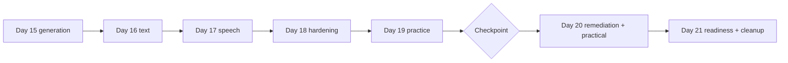

# Week 3 Dashboard: Generation, Text, Speech, Hardening and Exam Readiness (Days 15-21)

Goal: finish the remaining domain content (generation, text, speech), prove the capstone is defensible, then measure and close exam gaps.

## Days

| Day | Weekday | Planned | Topic | Objectives | Lab | Status |
|---|---|---|---|---|---|---|
| [15](day-15.md) | Mon | 75 | Image and video generation and editing | D3-01 to D3-05, D3-16 | [13](../labs/lab-13-image-generation-and-editing.md) | Not Started |
| [16](day-16.md) | Tue | 75 | Text analysis, PII, translation | D4-01 to D4-04, D2-13 | [14](../labs/lab-14-text-analysis-and-translation.md) | Not Started |
| [17](day-17.md) | Wed | 75 | Speech and audio | D4-05 to D4-08 | [15](../labs/lab-15-speech-and-audio.md) | Not Started |
| [18](day-18.md) | Thu | 75 | Hardening and red team | D1-13/16, D2-11/16, D3-15 | [16](../labs/lab-16-capstone-hardening.md) | Not Started |
| [19](day-19.md) | Fri | 75 | Practice assessment, **checkpoint** | All | none | Not Started |
| [20](day-20.md) | Sat | 270 | Remediation and final practical | All | [Practical](../exam-prep/PRACTICAL_ASSESSMENT.md) | Not Started |
| [21](day-21.md) | Sun | 270 | Final review, readiness, cleanup | All | none | Not Started |

Planned total: 5 x 75 + 2 x 270 = 915 min. Content days 15-18 are 300 min; review and assessment are 615 min (about 67%), because the build work is done and the exam is a recall and judgment test.

## Weekly diagram

## Checkpoint (Day 19)

Pass rule (this plan's own rule, not Microsoft's): overall practice score at or above 75% and no domain under 70%. Practice assessment scoring differs from the scaled 700 exam score, so use it as a signal.

| Check | Result |
|---|---|
| Practice assessment date and score | |
| Domain scores (D1 to D5) | |
| Domains under 70% | |
| Top 5 weak objectives | |
| Spend so far under EUR 15 | |

Branching:

| Outcome | Action |
|---|---|
| Pass | Day 20 remediation is a polish; keep the exam date |
| One domain under 70% | Spend the first 60 minutes of Day 20 on that domain |
| Two or more domains under 70% | Plan a 5-7 day extension after Day 21 and delay booking; use [CATCH_UP_PLAN.md](../CATCH_UP_PLAN.md) |

## Weak-area log

| Topic | Days to revisit | Fixed? |
|---|---|---|
| | | |

## Links

[Main README](../README.md) | [Tracker](../TRACKER.md) | [Week 2](../week-02/README.md) | [Exam prep checklist](../exam-prep/CHECKLIST.md) | [AI-500 bridge](../ai-500-bridge/README.md)
