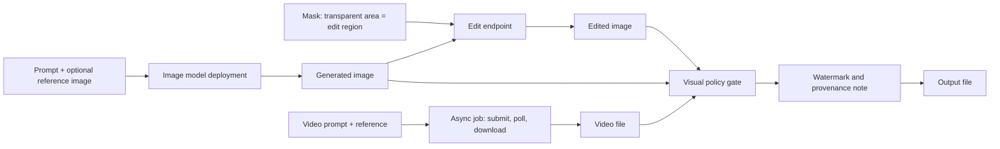

## Day 15: Image and Video Generation and Editing

### 1. Day at a Glance

| Item | Value |
|---|---|
| Weekday / time | Monday, 75 min planned |
| Status | Not Started |
| Difficulty | 3/5 |
| Objectives | D3-01, D3-02, D3-03, D3-04, D3-05, D3-16 (watermark side) |
| Label | Exam Essential for images; video is Concept (Optional demo) |
| Resources created | One image model deployment (if available to you) |
| Estimated cost | about EUR 1.00 for at most 10 low-quality images; video EUR 0 (concept only) |
| Lab | [Lab 13](../labs/lab-13-image-generation-and-editing.md) |
| Capstone milestone | M11 extended: generated images pass the visual policy gate and carry a watermark |

### 2. Why This Matters

Generation and editing are tested through scenario questions: which controls, which workflow for masked edits, how to keep results safe and compliant. Video generation is expensive and access-limited; you learn it through design and the official module, not by burning budget.

### 3. Prerequisites

[Day 14](../week-02/day-14.md): `check_image`, `describe`. Review the Week 2 checkpoint result and spend 20 minutes repairing the weakest topic before starting if it was under 9/12.

### 4. Learning Outcomes

- Generate an image from text with size and quality controls.
- Edit an image with a mask (inpainting) and with a prompt-only modification.
- Describe how video generation jobs differ (asynchronous, cost per duration, reference media).
- Apply a safety gate and a visible watermark to generated output.
- Estimate and cap spend.

### 5. Visual Explanation



### 6. Learn

Theory (15 min):

1. **Image generation** (4 min): a deployed image model takes a prompt and returns image data; controls include size, quality, number of images and output format. Higher quality and size cost more. Read the image generation page and the pricing page's image rows.
2. **Editing** (4 min): *inpainting* edits only a masked region (a PNG whose transparent area marks where to change); *prompt-driven modification* edits the whole image by instruction; *reference media* guides style or content. Model support differs; read the module and docs for your model.
3. **Video generation** (4 min): jobs are asynchronous (submit, poll, download), priced by duration and resolution, and often gated by access approval. Editing generated videos (for example remix or extend operations) depends on the model's supported operations; read the module and note which operations exist.
4. **Responsible output** (3 min): guardrails apply to prompts and generated images; add your own policy gate, a visible watermark, and provenance metadata in logs. Know that watermarks and content credentials are design requirements, not guarantees.

### 7. Resources

| Study | Link |
|---|---|
| Image generation | <https://learn.microsoft.com/en-us/azure/foundry/openai/how-to/dall-e> |
| Pricing (image rows) | <https://azure.microsoft.com/en-us/pricing/details/azure-openai/> |
| Learn modules | `generate-images-azure-openai`, `generate-video-with-foundry` in [RESOURCES.md](../RESOURCES.md) |
| Guardrails overview | <https://learn.microsoft.com/en-us/azure/foundry/guardrails/guardrails-overview> |

### 8. Hands-On Lab

**Step 1: Availability and deployment (5 min).** In the Foundry model catalog check which image models you can deploy (the pricing page lists models such as `gpt-image-1-mini`; availability and access approval vary). Deploy the cheapest one at minimum capacity. If none is available, switch to **design mode**: do steps 2-4 as written plans in your notes, do step 6 on an image from Day 14, and continue.

**Step 2: Generate (8 min).** `src\labs\lab13_images.py`:

```python
import base64
from pathlib import Path

from knowledgedesk.foundry_client import get_clients

_, client = get_clients()
result = client.images.generate(
    model="gpt-image-1-mini",  # your deployment name
    prompt="A flat-style illustration of a support desk with a laptop and a headset, no text",
    size="1024x1024",
    quality="low",
    n=1,
)
Path("out").mkdir(exist_ok=True)
Path("out/gen1.png").write_bytes(base64.b64decode(result.data[0].b64_json))
print(result.usage if hasattr(result, "usage") else "no usage reported")
```

Keep an image counter in `out\image_count.txt` and refuse to exceed 10 images in total today.

**Step 3: Mask edit (10 min).** Make a mask with Pillow: same size as the image, fully opaque except a transparent rectangle over the area to change.

```python
from PIL import Image

mask = Image.new("RGBA", (1024, 1024), (0, 0, 0, 255))
mask.paste((0, 0, 0, 0), (200, 200, 600, 600))  # transparent = region to edit
mask.save("out/mask.png")
```

```python
edited = client.images.edit(
    model="gpt-image-1-mini",
    image=open("out/gen1.png", "rb"),
    mask=open("out/mask.png", "rb"),
    prompt="Replace the laptop with a notebook and a coffee cup",
)
```

Save the result as `out\edit1.png`. Compare with the original.

**Step 4: Prompt-only modification and reference (5 min).** Call `images.edit` without a mask: "Change the color scheme to dark blue and orange". Note differences between masked and unmasked edits and which one preserved the untouched parts better.

**Step 5: Controls (5 min).** Generate one more image with `quality="medium"` (counts toward the 10). Compare detail and token/price information against `low`. Write the decision rule you would use.

**Step 6: Gate and watermark (7 min).** For every generated or edited file: run `check_image(path)` (Day 14), then add a visible watermark with Pillow (`ImageDraw.text`, for example "AI-generated" in a corner), write provenance (`model`, prompt hash, timestamp, file) to `out\provenance.jsonl`, and refuse to save if the gate blocks.

**Video concept task (5 min, part of Verify).** Read the video module. In [capstone/ARCHITECTURE.md](../capstone/ARCHITECTURE.md) or your notes, write the job flow (request fields, async polling, download, safety check, cost per second to verify from the pricing page, how a reference image would be supplied, which edit operations exist). Do not run a paid job unless the budget allows and your access is approved; if you do, use the shortest duration and lowest resolution and log the cost.

### 9. Break/Fix Challenge

1. **Blocked prompt.** Send a prompt in a clearly disallowed category (do not include real people). Expected: the service rejects it. Handle the error with a user-safe message and a log entry without the prompt text.
2. **Mask polarity.** Invert the mask (opaque where you wanted to edit). Observe the wrong region change; fix.
3. **Parameter error.** Request an unsupported size such as `"123x456"`. Read the error and restrict inputs with an allowlist.
4. **Budget guard.** Try to generate an 11th image and confirm your counter stops it.

### 10. Capstone Progress

M11 extended: `src/knowledgedesk/imagegen.py` with generate, edit, gate, watermark, provenance, and the 10-image cap. Add the generation path to the Azure deployment diagram in [capstone/ARCHITECTURE.md](../capstone/ARCHITECTURE.md) as an optional module.

### 11. Validation

- [ ] `gen1.png`, `edit1.png` exist (or design notes if no model was available).
- [ ] Watermark visible; provenance line written.
- [ ] Safety gate rejects a blocked test image.
- [ ] Image counter at or below 10; spend logged.
- [ ] Video job flow written.

### 12. Exam Focus

- Pick the editing workflow: inpainting (mask), prompt-only, reference-based.
- Generation controls: size, quality, count, format; cost grows with them.
- Video is async and costly; reference media and edit operations depend on the model.
- Responsible output: guardrails, policy gate, watermarking, provenance.

### 13. Review Questions

1. What marks the edit region in a mask? 2. Which setting trades quality for cost in image generation? 3. Why are video jobs asynchronous? 4. Where would you record that an image was AI-generated? 5. Why apply your own gate if the service has guardrails?

<details><summary>Answers</summary>

1. The transparent area of the mask image. 2. Quality (and size). 3. Generation takes long; clients submit, poll and download. 4. Visible watermark plus provenance metadata in logs/file metadata. 5. App-specific policy rules (brand, symbols) are not covered by generic guardrails.

</details>

### 14. Definition of Done

- [ ] Lab validation passes (or design mode completed).
- [ ] Break/fix cases done.
- [ ] Spend logged and under the day estimate.
- [ ] Progress entry and tracker updated.

### 15. Cleanup

Delete the image deployment if you will not use it again (it idles at no cost but keeps quota). Remove generated files with anything sensitive.

### 16. Progress Entry

| Field | Value |
|---|---|
| Status | Not Started |
| Theory done | |
| Lab done | |
| Break/fix done | |
| Capstone done | |
| Review done | |
| Planned time | 75 min |
| Actual time | |
| Confidence (1-5) | |
| Weak areas | |

### 17. Navigation

Previous: [Day 14](../week-02/day-14.md) | Next: [Day 16](day-16.md) | [Week 3 dashboard](README.md) | [Main README](../README.md) | [Tracker](../TRACKER.md)

### 18. Time Budget

| Block | Minutes |
|---|---|
| Learn | 15 |
| Build (steps 1-6: 5+8+10+5+5+7) | 40 |
| Break/Fix | 10 |
| Verify (incl. video notes) | 5 |
| Review and progress entry | 5 |
| **Total** | **75** |
