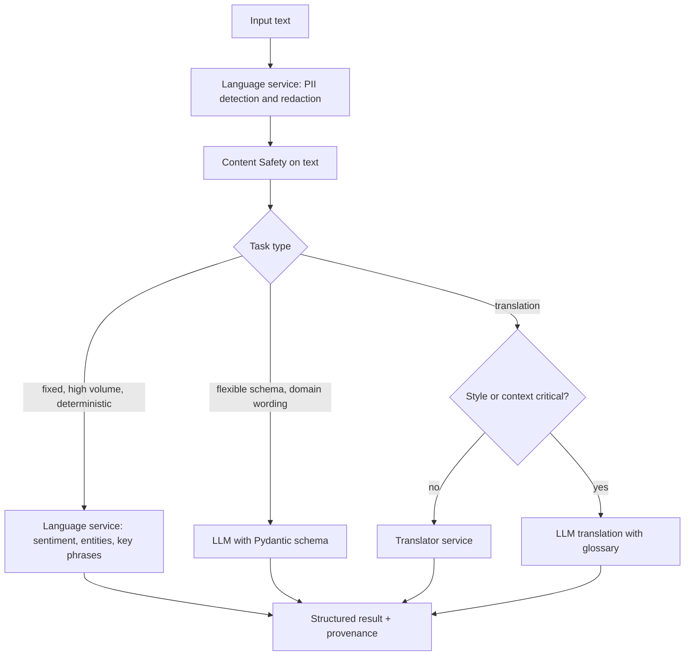

## Day 16: Text Analysis, PII, Sentiment, Domain Customization and Translation

### 1. Day at a Glance

| Item | Value |
|---|---|
| Weekday / time | Tuesday, 75 min planned |
| Status | Not Started |
| Difficulty | 3/5 |
| Objectives | D4-01, D4-02, D4-03, D4-04, D2-13 |
| Label | Exam Essential |
| Resources created | Language resource (F0 if offered), Translator F0 |
| Estimated cost | about EUR 0.20 |
| Lab | [Lab 14](../labs/lab-14-text-analysis-and-translation.md) |
| Capstone milestone | M12 (part 1): text analysis and translation modes in the CLI |

### 2. Why This Matters

Text analysis questions ask you to choose between generative prompting and the Language/Translator services, and to customize outputs for domain tasks such as compliance summaries. Cost, determinism and privacy are the usual deciding factors.

### 3. Prerequisites

[Day 15](day-15.md); structured outputs from [Day 4](../week-01/day-04.md); safety helpers from [Day 5](../week-01/day-05.md).

### 4. Learning Outcomes

- Extract entities, topics, summaries and sentiment with the Language service and with an LLM, and choose between them.
- Detect and redact sensitive content before a model sees it.
- Customize outputs for a domain with instructions, examples and a schema.
- Translate with the Translator service and with an LLM, and choose between them.

### 5. Visual Explanation



### 6. Learn

Theory (15 min):

1. **Language service features** (4 min): sentiment (with opinion mining), entity recognition, PII detection with redaction, key phrases, language detection, summarization and more. Read the service overview, the sentiment page and the PII page. Benefits: stable, cheap per unit, no prompt tuning, schemas fixed.
2. **LLM text analysis** (4 min): flexible output schemas, domain-specific instructions and few-shot examples, tone detection, summarization with constraints. Costs tokens, can vary run to run, needs validation.
3. **Sensitive content** (3 min): PII detection (Language), harmful content (Content Safety), and policy-specific rules (your code). Do redaction **before** sending text to a general model when policy requires.
4. **Translation choices** (4 min): Translator service for fast, consistent, high-volume translation (supports custom terminology features); LLM translation when tone, context or domain phrasing matters. Check Translator free-tier limits on the pricing page (2 million characters per month at the time of writing).

### 7. Resources

| Study | Link |
|---|---|
| Language service overview | <https://learn.microsoft.com/en-us/azure/ai-services/language-service/overview> |
| Sentiment | <https://learn.microsoft.com/en-us/azure/ai-services/language-service/sentiment-opinion-mining/overview> |
| PII detection | <https://learn.microsoft.com/en-us/azure/ai-services/language-service/personally-identifiable-information/overview> |
| Translator | <https://learn.microsoft.com/en-us/azure/ai-services/translator/text-translation/overview> |
| Learn modules | `analyze-text-ai-language`, `develop-text-analysis-agent-language-mcp`, `translate-text-speech` in [RESOURCES.md](../RESOURCES.md) |
| Lab repo | <https://github.com/MicrosoftLearning/mslearn-ai-language> |

### 8. Hands-On Lab

**Step 1: Resources (6 min).** Create **Language** (F0 if the portal offers it; check what it shows) and **Translator** (F0). Set `LANGUAGE_ENDPOINT`, `TRANSLATOR_REGION`, `TRANSLATOR_KEY`. Role for Language: `Cognitive Services User`. For Translator the lab uses a key with the global endpoint; record this as a documented exception in [capstone/SECURITY.md](../capstone/SECURITY.md) (check the Translator docs for Entra options). `pip install azure-ai-textanalytics azure-ai-translation-text`.

**Step 2: Language service (10 min).** Create 6 sample texts (customer emails and a short compliance note; include a fake name, phone number and email).

```python
from azure.ai.textanalytics import TextAnalyticsClient
from azure.identity import DefaultAzureCredential

from common.config import require

ta = TextAnalyticsClient(require("LANGUAGE_ENDPOINT"), DefaultAzureCredential())
docs = ["Contoso support was slow, but Maria Lopez fixed my billing issue. Call me at 555-0100."]
sent = ta.analyze_sentiment(docs)[0]
print(sent.sentiment, sent.confidence_scores)
pii = ta.recognize_pii_entities(docs)[0]
print(pii.redacted_text, [(e.text, e.category) for e in pii.entities])
print([(e.text, e.category) for e in ta.recognize_entities(docs)[0].entities])
```

**Step 3: LLM text analysis (10 min).** `src\knowledgedesk\text_analysis.py` with a Pydantic `TextInsights` (entities list, topics list, one-sentence summary, sentiment, tone, `contains_sensitive_content: bool`) parsed via `responses.parse` (Day 4). Run on the same 6 texts. Fill a comparison table: output quality, tokens, latency, cost, determinism (run twice).

**Step 4: Domain customization (8 min).** Build a compliance summarizer: schema `ComplianceSummary(risk_level: Literal["low","medium","high"], findings: list[str], required_actions: list[str])`, a system prompt with the domain rules, and 2 few-shot examples. Test on 5 notes and score with a rubric (no invented facts, correct risk level). Try a different reasoning effort or output token limit and record the effect.

**Step 5: Translation (6 min).**

```python
from azure.core.credentials import AzureKeyCredential
from azure.ai.translation.text import TextTranslationClient

tc = TextTranslationClient(
    endpoint=require("TRANSLATOR_ENDPOINT"),
    credential=AzureKeyCredential(require("TRANSLATOR_KEY")),
    region=require("TRANSLATOR_REGION"),
)
result = tc.translate(body=["Open a support ticket in the resource group."], to_language=["fr", "de"])
for item in result[0].translations:
    print(item.to, item.text)
```

The signature changed between major versions (the parameter is `to_language`); use `help(tc.translate)` if your version differs. Translate 5 sentences with domain terms with the service and with an LLM (give it a glossary and a tone). Compare.

### 9. Break/Fix Challenge

1. **PII to the model.** Send a text with a phone number directly to the LLM summarizer and observe the PII in the output. Fix the pipeline order: Language PII redaction first, then the model; verify the redacted text is what the model sees.
2. **Oversized input.** Send a very long text to the Language service. Observe the limit error (check the service limits page for the per-document size) and add chunking.
3. **Translator auth.** Remove the `region` argument or use the wrong key. Read the 401 and fix.

### 10. Capstone Progress

M12 part 1: `text_analysis.py` and CLI command `kd analyze <file>` with PII redaction first and a `--translate <lang>` option. Add the "choose service" decision table to [capstone/ARCHITECTURE.md](../capstone/ARCHITECTURE.md).

### 11. Validation

- [ ] Sentiment and PII redaction output for 6 texts.
- [ ] LLM vs Language comparison table filled.
- [ ] Compliance summarizer scored on 5 notes.
- [ ] Service vs LLM translation compared on 5 sentences.
- [ ] PII never reaches the model in the final pipeline (test by inspecting the request text).

### 12. Exam Focus

- Language service (deterministic, cheap) versus LLM (flexible, costly): know the criteria.
- Redact sensitive content before generation when required.
- Translator service vs LLM translation: consistency and scale vs context and tone.
- Domain customization uses instructions, examples, schemas and parameters (D4-04, D2-13).

### 13. Review Questions

1. When prefer Language sentiment over an LLM? 2. Why redact before the model call? 3. What makes LLM translation attractive and what is the risk? 4. Which part of a prompt controls domain terminology? 5. How do you check that a summarizer does not invent facts?

<details><summary>Answers</summary>

1. High volume, fixed output, low cost and determinism needed. 2. Avoid exposing PII to extra systems and logs. 3. Better tone and context; variability and cost, and it can alter meaning. 4. A glossary or few-shot examples in the instructions. 5. Evaluate groundedness against the source text and review samples.

</details>

### 14. Definition of Done

- [ ] Lab validation passes.
- [ ] Break/fix cases done.
- [ ] CLI command works.
- [ ] Progress entry and tracker updated.

### 15. Cleanup

Keep Language and Translator F0 until Day 21. Remove sample texts containing real personal data (none should exist).

### 16. Progress Entry

| Field | Value |
|---|---|
| Status | Not Started |
| Theory done | |
| Lab done | |
| Break/fix done | |
| Capstone done | |
| Review done | |
| Planned time | 75 min |
| Actual time | |
| Confidence (1-5) | |
| Weak areas | |

### 17. Navigation

Previous: [Day 15](day-15.md) | Next: [Day 17](day-17.md) | [Week 3 dashboard](README.md) | [Main README](../README.md) | [Tracker](../TRACKER.md)

### 18. Time Budget

| Block | Minutes |
|---|---|
| Learn | 15 |
| Build (steps 1-5: 6+10+10+8+6) | 40 |
| Break/Fix | 10 |
| Verify | 5 |
| Review and progress entry | 5 |
| **Total** | **75** |
