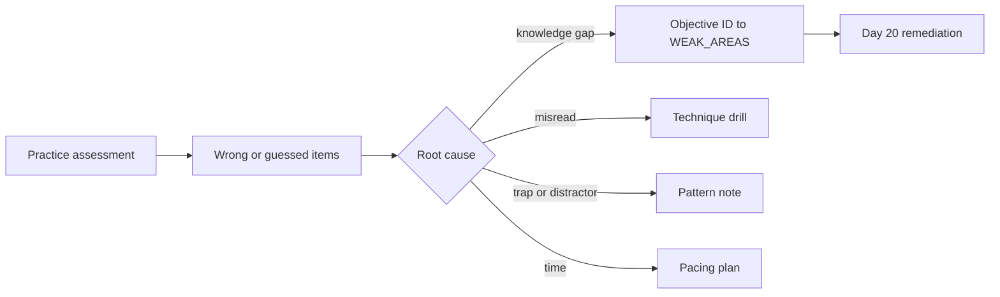

## Day 19: Practice Assessment, Exam-Style Review and the Week 3 Checkpoint

### 1. Day at a Glance

| Item | Value |
|---|---|
| Weekday / time | Friday, 75 min planned |
| Status | Not Started |
| Difficulty | 3/5 |
| Objectives | All 64 (diagnostic); see [exam-prep/DOMAIN_REVIEW.md](../exam-prep/DOMAIN_REVIEW.md) |
| Label | Exam Essential |
| Resources created | None |
| Estimated cost | EUR 0 |
| Lab | None (this is an exam-practice session) |
| Capstone milestone | Prepare the demo script for [Day 20](day-20.md) |

### 2. Why This Matters

By now you have built most of the topics. The practice assessment shows what you can recall under exam conditions, which is different from what you can build with documentation open. Use it as a diagnostic, not as a score to chase.

### 3. Prerequisites

[Day 18](day-18.md). Sleep and a quiet room: treat this like the real thing for the first 45 minutes.

### 4. Learning Outcomes

- Take the official practice assessment under realistic constraints.
- Convert wrong answers into root causes and objective IDs.
- Produce a ranked weak-area list that drives Day 20.
- Know the exam format, timing and policies.

### 5. Visual Explanation

### 6. Learn

Theory (10 min), then reuse it during the session:

1. **Format and policy** (5 min). Read the study guide's exam details, the exam duration and experience page and the retake policy (links in [RESOURCES.md](../RESOURCES.md)). Planning notes: 120 minutes, passing score 700 (scaled), proctored delivery. Verify these on the live pages because they can change. Try the exam sandbox once to see the interface and question types.
2. **Technique** (5 min). Read the whole question and every option; underline constraints (cost, latency, residency, least privilege, keyless); eliminate options that violate a constraint; for "which service" questions, name the one capability that decides; flag and move on if stuck for more than 2 minutes; review flagged items last; do not change an answer without a concrete reason.

### 7. Resources

| Study | Link |
|---|---|
| Study guide (find the Practice Assessment link on this page) | <https://learn.microsoft.com/en-us/credentials/certifications/resources/study-guides/ai-103> |
| Exam duration and experience | <https://learn.microsoft.com/en-us/credentials/support/exam-duration-exam-experience> |
| Exam scoring reports | <https://learn.microsoft.com/en-us/credentials/certifications/exam-scoring-reports> |
| Retake policy | <https://learn.microsoft.com/en-us/credentials/support/retake-policy> |
| Exam sandbox | <https://go.microsoft.com/fwlink/?linkid=2226877> |

### 8. Hands-On Lab

This is a practice session, not a code lab.

1. **Setup (5 min).** Close documentation tabs, notes and the IDE. Open the practice assessment from the study guide page.
2. **Take the assessment (35 min).** Use realistic pacing: roughly one minute per question at the exam's rate (about 120 minutes for the real exam; check the practice assessment's length and split it if needed, finishing the remainder first thing on [Day 20](day-20.md)). Mark every question you guessed or found uncertain.
3. **Record results (5 min).** Copy domain scores and the list of missed/uncertain questions into [exam-prep/WEAK_AREAS.md](../exam-prep/WEAK_AREAS.md). Practice assessments use their own scoring and are not the same as the scaled 700 score.
4. **Map to objectives (done inside the post-mortem below).** For each wrong or guessed item, write the topic and the closest objective ID from [EXAM_OBJECTIVES.md](../EXAM_OBJECTIVES.md). Do not copy question text into your notes; describe the concept instead.

### 9. Break/Fix Challenge

Error post-mortem and objective mapping (10 min). For each miss, classify the root cause: **knowledge gap**, **misread**, **trap/distractor**, **time pressure**. Then choose one fix per cause:

| Root cause | Fix |
|---|---|
| Knowledge gap | Add objective ID to the Day 20 remediation list; link a lab or doc |
| Misread | Underline constraints on the next 5 questions you read |
| Trap | Write the pattern (for example "keys vs managed identity" or "deployment name vs model name") in the weak-area log |
| Time | Set checkpoints (for example question 20 at 40 minutes) |

### 10. Capstone Progress

Write the **demo script** for Day 20 in [capstone/TASKS.md](../capstone/TASKS.md): a 10-minute run through ingestion (documents), a grounded answer with citations, an approved ticket, a blocked injection (text and image), a trace, and an evaluation report.

### 11. Validation

- [ ] Practice assessment completed (or half done with a note).
- [ ] Domain scores recorded.
- [ ] Every miss mapped to an objective ID and root cause.
- [ ] Top 5 weak areas ranked.

### 12. Exam Focus

Use today's results with the [domain review](../exam-prep/DOMAIN_REVIEW.md). Expect scenario questions about service selection, security, evaluation and agent design more than code syntax.

### 13. Review Questions

Self-check your pacing, not content:

1. How many questions did you flag and how many changed after review? 2. Which domain cost you most time? 3. Which constraint words did you miss at least once? 4. Which topic would you do differently with the docs closed? 5. What is your pacing checkpoint for the real exam?

Guidance

If more than 20% of flagged answers changed to wrong, slow down on first reads and change answers only with a concrete reason. If one domain consumed disproportionate time, drill it on Day 20.

### 14. Definition of Done

- [ ] Assessment completed and recorded.
- [ ] Weak areas ranked.
- [ ] Demo script written.
- [ ] Week 3 checkpoint recorded below and in [week-03/README.md](README.md).
- [ ] Progress entry and tracker updated.

### 15. Cleanup

Nothing to delete. Do not store question text.

### 16. Progress Entry

| Field | Value |
|---|---|
| Status | Not Started |
| Theory done | |
| Lab done (practice session) | |
| Break/fix done (post-mortem) | |
| Capstone done (demo script) | |
| Review done | |
| Planned time | 75 min |
| Actual time | |
| Confidence (1-5) | |
| Weak areas | |
| Practice score by domain | |

### 17. Navigation

Previous: [Day 18](day-18.md) | Next: [Day 20](day-20.md) | [Week 3 dashboard](README.md) | [Main README](../README.md) | [Tracker](../TRACKER.md)

### 18. Time Budget

| Block | Minutes |
|---|---|
| Learn (format and technique) | 10 |
| Practice assessment and setup | 45 |
| Break/Fix (error post-mortem) | 10 |
| Verify (domain table, weak-area ranking) | 5 |
| Review, demo script, progress entry | 5 |
| **Total** | **75** |
