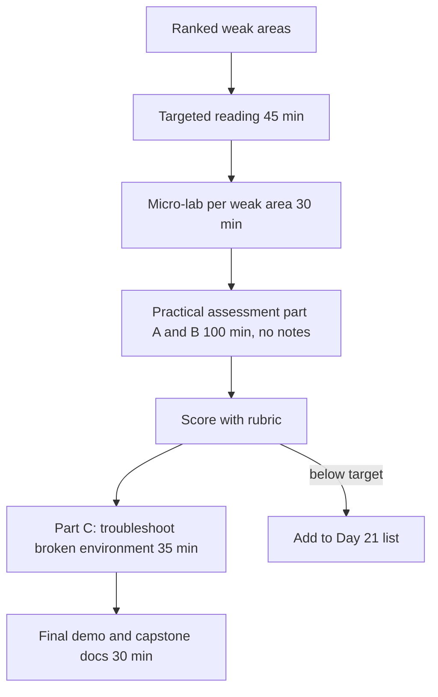

## Day 20: Remediation and the Final Practical Assessment

### 1. Day at a Glance

| Item | Value |
|---|---|
| Weekday / time | Saturday, 270 min planned |
| Status | Not Started |
| Difficulty | 4/5 |
| Objectives | Your top weak objectives from [Day 19](day-19.md) plus a cross-domain practical |
| Label | Exam Essential |
| Resources created | None; reuse existing |
| Estimated cost | about EUR 0.50 |
| Lab | None new; uses [exam-prep/PRACTICAL_ASSESSMENT.md](../exam-prep/PRACTICAL_ASSESSMENT.md) |
| Capstone milestone | M14 final demo |

### 2. Why This Matters

Repairing the weakest areas gives the highest score return per hour. A timed practical without notes tells you whether you can reproduce key patterns when the documentation is not guiding you.

### 3. Prerequisites

[Day 19](day-19.md) completed with a ranked weak-area list in [exam-prep/WEAK_AREAS.md](../exam-prep/WEAK_AREAS.md). Spend so far should be under EUR 15 ([COST_TRACKER.md](../COST_TRACKER.md)).

### 4. Learning Outcomes

- Close at least the top 3 weak areas with evidence (a re-run lab step and 3 new flash questions each).
- Complete the practical assessment within time and score it with the rubric.
- Diagnose and fix a deliberately broken environment.
- Record a final capstone demo and finish the capstone docs.

### 5. Visual Explanation

### 6. Learn

Targeted remediation reading (45 min). For each of your top weak objectives choose the matching material and read only that part:

| Domain of weakness | Fast repair material |
|---|---|
| D1 plan and manage | Day 2/3/12 files, deployment types page, RBAC page, quotas page, guardrails page |
| D2 generative and agents | Day 4/8/9/10/11 files, agents overview, function-calling page, observability page |
| D3 vision | Day 14/15 files, vision chat page, Content Understanding image/video pages |
| D4 text and speech | Day 16/17 files, Language and Speech overviews |
| D5 extraction | Day 6/13 files, search overviews, Content Understanding and layout pages |

Rules: read to answer a specific question you got wrong; stop reading when you can state the rule in one sentence; write the sentence in WEAK_AREAS.

### 7. Resources

| Study | Link |
|---|---|
| Domain review | [exam-prep/DOMAIN_REVIEW.md](../exam-prep/DOMAIN_REVIEW.md) |
| Practical assessment | [exam-prep/PRACTICAL_ASSESSMENT.md](../exam-prep/PRACTICAL_ASSESSMENT.md) |
| Objectives | [EXAM_OBJECTIVES.md](../EXAM_OBJECTIVES.md) |
| Official links | [RESOURCES.md](../RESOURCES.md) |

### 8. Hands-On Lab

**Step 1: Micro-labs on weak areas (30 min).** For each of the top 3 weak objectives: re-run the relevant lab step **from memory** (no notes, 8-10 minutes), then write 3 flash questions with answers in WEAK_AREAS. If you pass without help mark the item `Fixed`; if not, keep it for Day 21.

**Step 2: Practical assessment parts A and B (100 min).** Open [PRACTICAL_ASSESSMENT.md](../exam-prep/PRACTICAL_ASSESSMENT.md). Part A: design scenarios (25 min). Part B: timed hands-on tasks (75 min). Use only your own capstone code and the official documentation links you listed in RESOURCES; no search engines, no AI assistance. Score yourself with the rubric right afterwards while the details are fresh.

### 9. Break/Fix Challenge

Part C of the practical assessment (35 min): a deliberately broken environment (ask a friend to break it, or break it yourself by applying 5 of the listed faults a day earlier and not looking at them). Diagnose using logs, error messages, the portal and your traces; record time to diagnose each fault.

### 10. Capstone Progress

M14: 10-minute demo run following the script from Day 19; record a short screen capture or write the run log; finalize [capstone/README.md](../capstone/README.md), TESTING and COSTS with real numbers. Update the capstone architecture diagrams so that they match what you built.

### 11. Validation

- [ ] Top 3 weak areas re-run from memory; status recorded.
- [ ] Practical Parts A and B scored with the rubric; total recorded.
- [ ] Part C faults fixed; diagnosis times recorded.
- [ ] Demo log saved.
- [ ] Capstone docs match the code.

### 12. Exam Focus

Focus on the pattern behind each practical task: which service, which identity, which control, which metric. The exam rewards recognizing the pattern faster than typing the code.

### 13. Review Questions

1. Which three objectives improved today and what was the deciding rule for each? 2. Which practical task took longest and why? 3. What would you check first when a call returns 403? 4. When a RAG answer is wrong, which layer do you inspect first? 5. Which control would you add if you had one more day?

Guidance

Expected diagnostics: 403 -> role assignment and endpoint form; wrong RAG answer -> retrieved chunks first, then prompt, then data freshness; unexplained cost -> Cost Management by resource, then token logs.

### 14. Definition of Done

- [ ] Remediation evidence recorded.
- [ ] Practical scored; [WEAK_AREAS](../exam-prep/WEAK_AREAS.md) updated.
- [ ] Final demo run complete.
- [ ] Progress entry and tracker updated.

### 15. Cleanup

Do not delete resources yet; Day 21 does the full cleanup after your last review. Make sure Search and Application Insights are still Free/capped.

### 16. Progress Entry

| Field | Value |
|---|---|
| Status | Not Started |
| Theory done | |
| Lab done (remediation + practical A/B) | |
| Break/fix done (Part C) | |
| Capstone done (demo) | |
| Review done | |
| Planned time | 270 min |
| Actual time | |
| Confidence (1-5) | |
| Weak areas | |
| Practical score | |

### 17. Navigation

Previous: [Day 19](day-19.md) | Next: [Day 21](day-21.md) | [Week 3 dashboard](README.md) | [Main README](../README.md) | [Tracker](../TRACKER.md)

### 18. Time Budget

| Block | Minutes |
|---|---|
| Learn (targeted remediation reading) | 45 |
| Build (micro-labs 30 + practical A and B 100) | 130 |
| Break/Fix (practical Part C) | 35 |
| Verify (scoring with rubric) | 15 |
| Capstone demo and docs | 30 |
| Buffer | 15 |
| **Total** | **270** |
