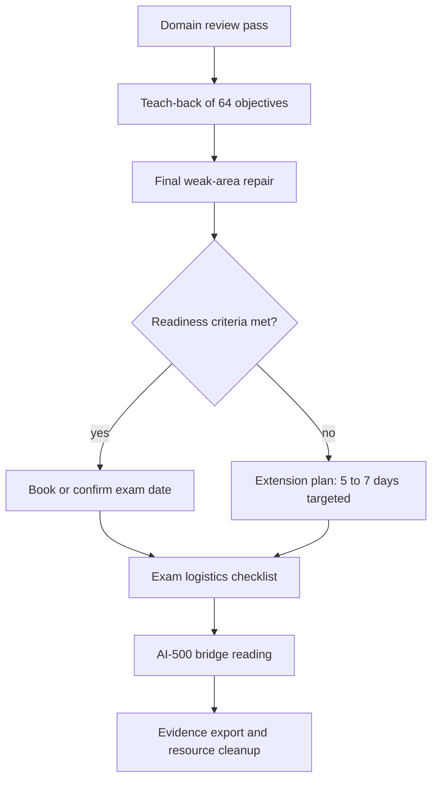

## Day 21: Final Review, Readiness Decision, AI-500 Bridge and Cleanup

### 1. Day at a Glance

| Item | Value |
|---|---|
| Weekday / time | Sunday, 270 min planned |
| Status | Not Started |
| Difficulty | 3/5 |
| Objectives | All 64 (final pass) |
| Label | Exam Essential; AI-500 bridge is AI-500 Foundation |
| Resources created | None; resources are deleted today |
| Estimated cost | EUR 0 |
| Lab | None new |
| Capstone milestone | Capstone archived; resources cleaned up |

### 2. Why This Matters

The last day converts practice into a decision: book the exam, or extend with a specific plan. It also stops idle cost and sets up what to study next.

### 3. Prerequisites

[Day 20](day-20.md) scores and updated [WEAK_AREAS](../exam-prep/WEAK_AREAS.md).

### 4. Learning Outcomes

- Walk all five domains and explain each objective in your own words.
- Apply the readiness criteria and decide go or extend.
- Prepare exam logistics.
- Understand what AI-500 adds on top of AI-103.
- Delete resources and record final costs.

### 5. Visual Explanation



### 6. Learn

Domain review pass (45 min): read [DOMAIN_REVIEW.md](../exam-prep/DOMAIN_REVIEW.md) in order, about 9 minutes per domain. For each decision table, cover the right column and answer from memory. Note anything you cannot answer in WEAK_AREAS.

### 7. Resources

| Study | Link |
|---|---|
| Domain review | [exam-prep/DOMAIN_REVIEW.md](../exam-prep/DOMAIN_REVIEW.md) |
| Readiness checklist | [exam-prep/CHECKLIST.md](../exam-prep/CHECKLIST.md) |
| AI-500 bridge | [ai-500-bridge/README.md](../ai-500-bridge/README.md) |
| Exam policies | <https://learn.microsoft.com/en-us/credentials/support/exam-duration-exam-experience> |
| Retake policy | <https://learn.microsoft.com/en-us/credentials/support/retake-policy> |

### 8. Hands-On Lab

**Step 1: Scenario drill (45 min).** Use the "scenario drill" table in DOMAIN_REVIEW: for each of 20 scenarios decide the service/control/model before looking at the answer. Record your accuracy per domain.

**Step 2: Teach-back (40 min).** Open [TRACKER.md](../TRACKER.md) objective map. For each ID say aloud (or write one sentence): what it is, which lab you built it in, and one failure mode. Update the confidence number; any 1 or 2 goes into step 3.

**Step 3: Exam logistics (15 min).** Read the exam-experience page: identification, environment checks for online proctoring (or test center rules), allowed items, break rules, how to reschedule. Book or confirm the date if you decide "go" in the Verify block. Do a system test on the machine you will use.

**Step 4: AI-500 bridge (30 min).** Read [ai-500-bridge/README.md](../ai-500-bridge/README.md) and the AI-500 study guide. Write your own plan to move from AI-103 to AI-500 (what you already built, what is missing).

### 9. Break/Fix Challenge

Final weak-area repair (35 min). Pick the 2 lowest-confidence objective IDs from Step 2. For each: re-run the relevant lab step or write a 10-line explanation from memory, then check against the docs. Record `Fixed` or `Carry` in WEAK_AREAS.

### 10. Capstone Progress

Final capstone tasks (part of the 30-minute cleanup block):

1. Export evidence: final cost ledger, evaluation reports, red-team report, a short README of how to run the demo.
2. Confirm no secrets are in git history (`git log -p` search for key patterns) and `.env` is ignored.
3. Decide what to keep: code and docs only; Azure resources go.

### 11. Validation

- [ ] Scenario drill accuracy recorded per domain.
- [ ] All 64 objectives have a confidence value.
- [ ] Readiness decision recorded in [exam-prep/CHECKLIST.md](../exam-prep/CHECKLIST.md).
- [ ] Exam date booked or extension plan written.
- [ ] Cleanup done; final cost recorded.

### 12. Exam Focus

Final rules to remember: keyless over keys; least privilege; match the service to the capability; guard inputs, documents and outputs; evaluate and trace; free tier limits; deployment name versus model name; tool approval in code.

### 13. Review Questions

1. Which five patterns matter most on your weakest domain? 2. What would make you postpone the exam? 3. What is the first thing you check on exam day? 4. Which AI-500 topic would you start with? 5. What did the whole prep cost compared with your budget?

<details><summary>Guidance</summary>

Postpone if any domain scored under 70% in the last full practice and you cannot fix it in the extension window; if the practical score is under target; or if more than 5 objectives are at confidence 1-2.

</details>

### 14. Definition of Done

- [ ] Readiness decision recorded.
- [ ] Exam logistics prepared.
- [ ] AI-500 plan written.
- [ ] Resources deleted (or intentionally kept, with a reason).
- [ ] Progress entry, tracker and cost tracker finalized.

### 15. Cleanup

Do this last, after you have exported what you need. Deleting the resource group is irreversible, so confirm you no longer need anything in it.

```powershell
az group delete --name rg-ai103-prep --yes --no-wait
az group exists --name rg-ai103-prep
```

Deleted AI Services resources may remain in a soft-deleted state that holds names and quota; list and purge them via the portal's "Manage deleted resources" or the current CLI docs if you plan to reuse the names. Remove the Entra role assignments you created for CI if any, delete the budget alerts only if you no longer need them, and double-check Cost Management the next day.

### 16. Progress Entry

| Field | Value |
|---|---|
| Status | Not Started |
| Theory done | |
| Lab done (drills, teach-back) | |
| Break/fix done (final repair) | |
| Capstone done (archive, cleanup) | |
| Review done | |
| Planned time | 270 min |
| Actual time | |
| Confidence (1-5) | |
| Weak areas | |
| Readiness decision | |
| Exam date | |
| Final cost (EUR) | |

### 17. Navigation

Previous: [Day 20](day-20.md) | Next: none (see [AI-500 bridge](../ai-500-bridge/README.md)) | [Week 3 dashboard](README.md) | [Main README](../README.md) | [Tracker](../TRACKER.md)

### 18. Time Budget

| Block | Minutes |
|---|---|
| Learn (domain review pass) | 45 |
| Build (drill 45 + teach-back 40 + logistics 15 + AI-500 30) | 130 |
| Break/Fix (final repair) | 35 |
| Verify (readiness decision) | 15 |
| Capstone archive and cleanup | 30 |
| Buffer | 15 |
| **Total** | **270** |
